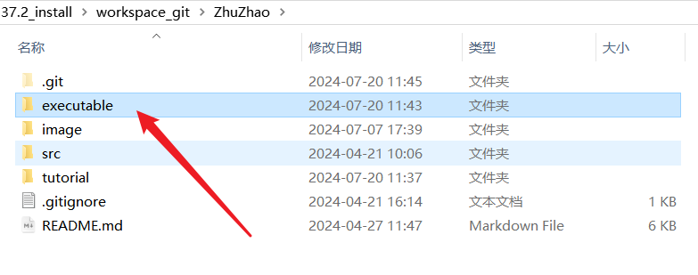
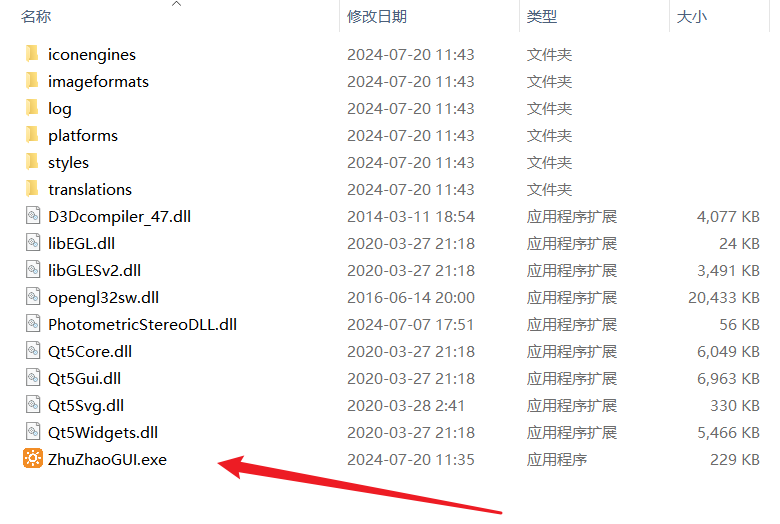
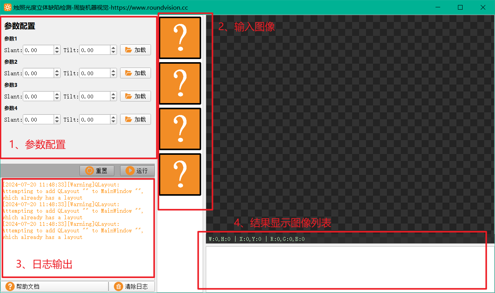
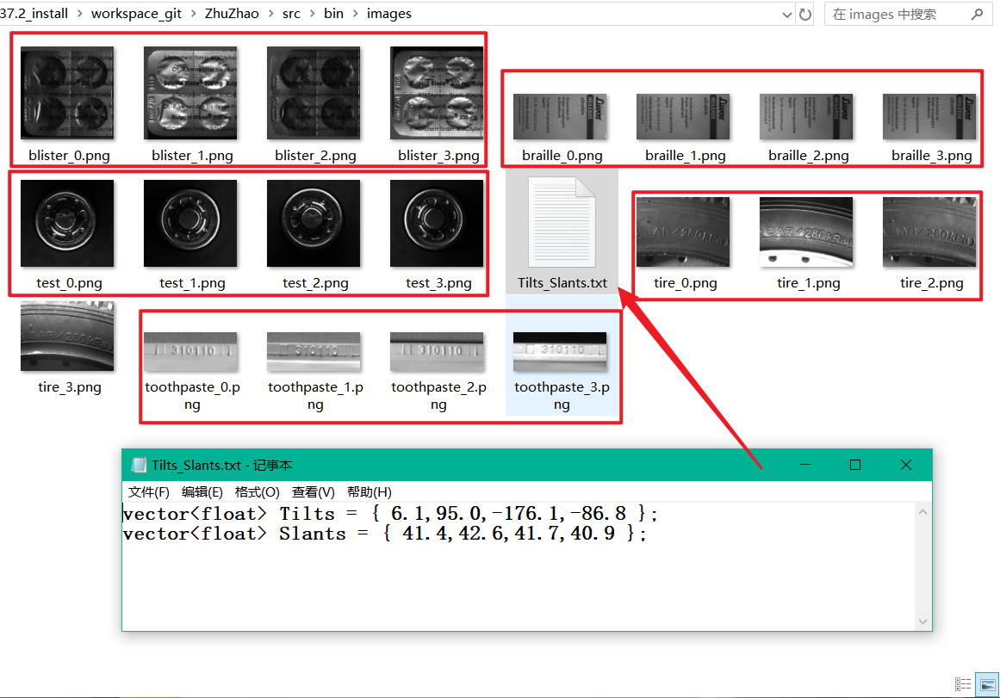

## 烛照光度立体算法软件运行方法

本节讲一下烛照这个软件是怎么运行的，不是工程如何跑起来，这个我们第三章会讲，我们先讲一下单纯软件是怎么用起来的。

首先进入我们的项目目录：

我们提供了executable文件夹，也就是打包好的可执行文件，进入，里面有我们的ZhuZhaoGUI.exe，直接双击运行:

软件包含四个组成部分：

1. 输入参数配置部分，是我们光度立体算法需要的输入参数，包含共4张图像，8个角度参数。你现在不理解这些参数的含义没有关系，我们会在后面章节介绍。
2. 为了方便预览，我们将四张输入图像放到图像列表中，方便查看
3. 为了方便，我们提供了日志窗口
4. 光度立体算法会有三张输出图像，点击运行后会生成在结果显示图像列表中

在ZhuZhao\src\bin\images目录内，我们为大家准备好了四组用于测试的图像，这四组图像对应的8个角度参数都是一样的，我们也在目录内给大家写好了：

只需要按顺序导入图像，并填写图像对应的角度参数值，点击软件界面的运行按钮，即可完成光度立体算法的运行。

**需要注意的一点就是，我们为每张图都标了序号，必须依次导入，图1的角度参数，必须是我们提供的角度数组中的第一个角度值，依次类推。**