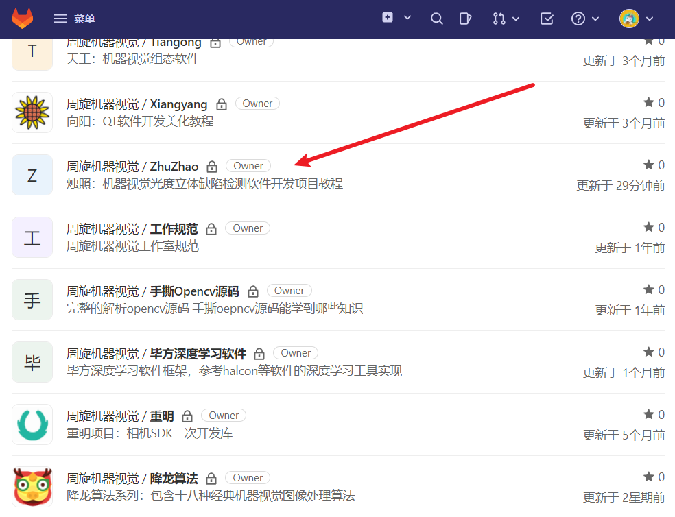
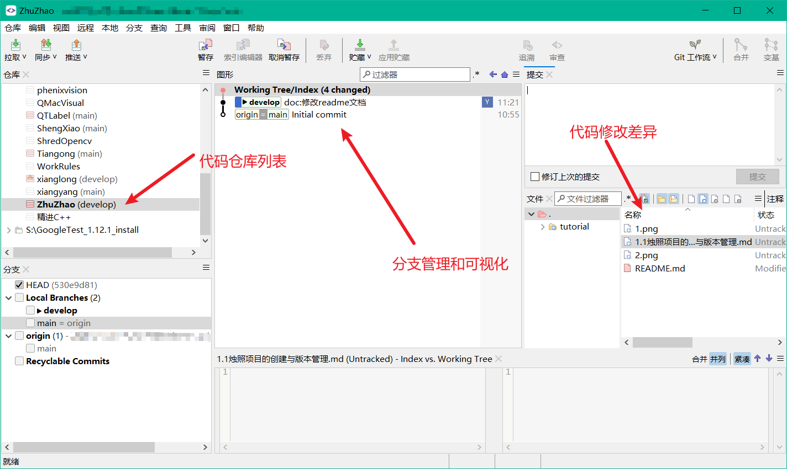
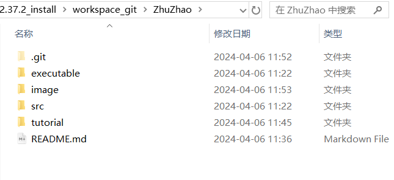

## 烛照项目的创建与版本管理

大家好我是周旋，欢迎大家来学习烛照：机器视觉光度立体缺陷检测项目。本项目是一个手把手级别的项目。所以我们直接从我们项目的创建开始讲起。

首先，我【周旋机器视觉】的项目代码，都不是直接存到我本地电脑的，而是存到了服务器上。这个云服务器每年大概要付费一千多元使用。我在云服务器上部署安装了gitlab代码管理服务，我的代码都是存到云上的gitlab的。

这样的好处很显而易见：

1. 云服务器和本地服务器双重备份，可以尽量避免代码丢失的惨案发生。
2. 使用gitlab（大家可以将它等同于github，是一个可供私人或公司使用的代码管理仓库），可以方便的管理我所有的项目。
3. gitlab配合git使用，可以方便的实现代码的版本管理。这个在本项目中也将演示给大家。

### 1、项目创建

所以创建烛照项目，我直接在gitlab上创建了一个空项目：

可以看到仓库里有很多开发完或者正在开发的项目，包括降龙算法和重明工业相机这两个我们已经在官网(www.roundvision.cc)发布的项目。

然后我们使用git将项目拉取到本地，这里我使用的是smartgit，这是一款git的可视化工具：

然后来看我们的本地文件夹，不论是我们自己的项目，还是取gitHub上开源项目，项目都会有一个相对统一的文件夹组成结构，如下图：

我们项目一开始创建的时候只有一个.git版本管理文件夹，和一个README.md文件，剩下的都是我后来创建的：

1. executable：里面存放了我们打包好的软件可执行二进制文件夹以及所有依赖的动态库。也就是说在不考虑兼容性的问题下，exe文件夹里面的可执行文件应该是直接双击就可以运行，并查看和演示我们效果的。
2. image：里面存放图片，这些图片都是在README文档里引用的图片。
3. src：这个很好理解了，存放我们所有的源码
4. tutorial：教程文件夹，一般项目都不会有这个tutorial文件夹，但我们的项目是教学项目，所以我们在tutorial文件夹内存放了我们所有的教学文档。
5. readme文档：这个大家应该都不陌生了，每个项目都会有一个readme文档，该文档会在项目首页显示，每个学习该项目的人都会首先查看readme文档。我们可以在该文档写项目介绍、项目运行依赖环境、项目意义等等。

### 2、项目版本管理

不知道大家在做项目时会不会进行项目管理，又会使用什么做项目管理。

可能常用的和大家常听到的都是小乌龟SVN，但我们使用的是git，github上的开源项目也都是使用git管理的。我们不评论两者的优劣好坏，我只能说当你学会git的时候，你自然就会有答案。

前面我们已经说过了，我们项目管理在云服务器的gitlab上，使用git管理，如果你在网上一搜git，可能都是教你git各种命令行的，我们不使用黑框框的git命令行，我们使用git可视化工具smartgit。

在我们的项目教程中会涉及一些git和smartgit的使用，但我们本项目不会专门讲解这些，如果你对此感兴趣，可以百度学习一下或者在我视频涉及版本控制和代码提交的时候看一下我是如何做的。这不是我们本项目的重点。

如果你参加到工作中，那你就必然会接触到这些，在面试时也不会因为你不会git而怎么样。

#### THE END

好了，我们的项目到此就创建成功了，开发时是先在本地开发，然后提交开发内容到服务器保存。同时我们要做分支管理，还要做版本管理。

接下来我就要投入到项目的开发中了。

