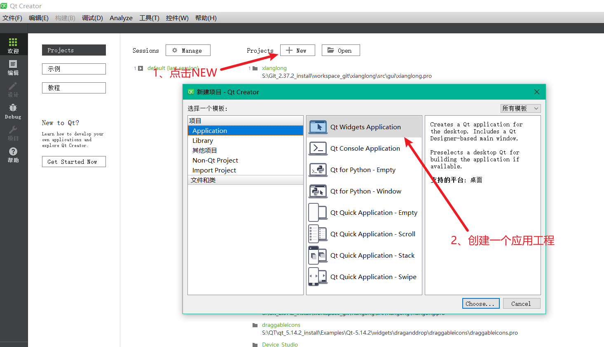
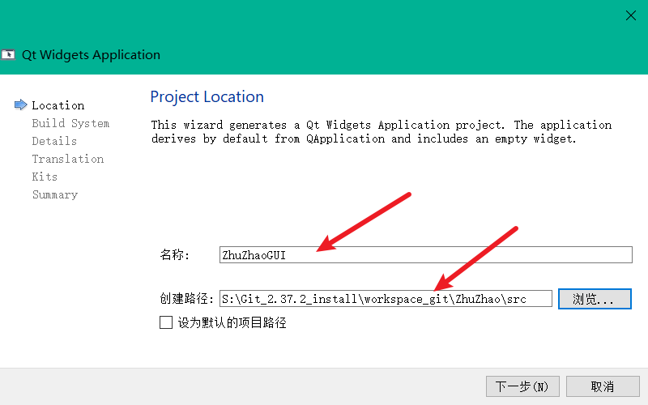
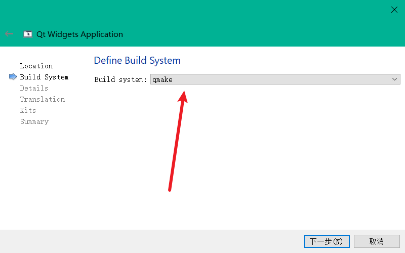
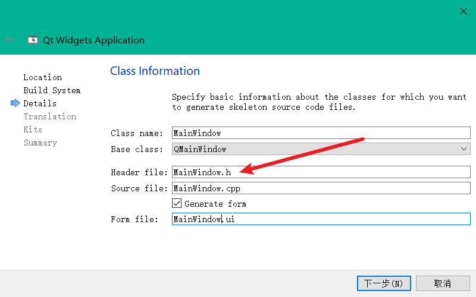
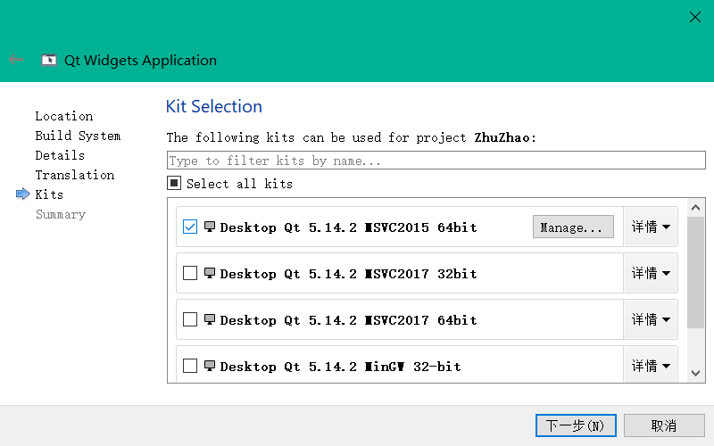
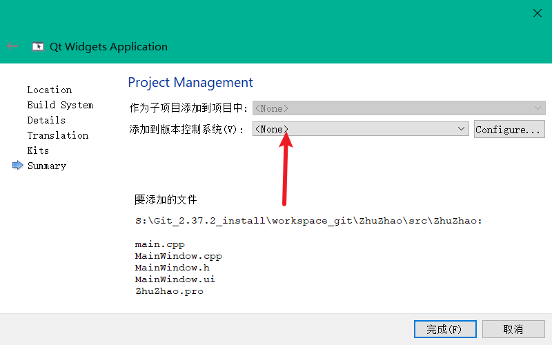
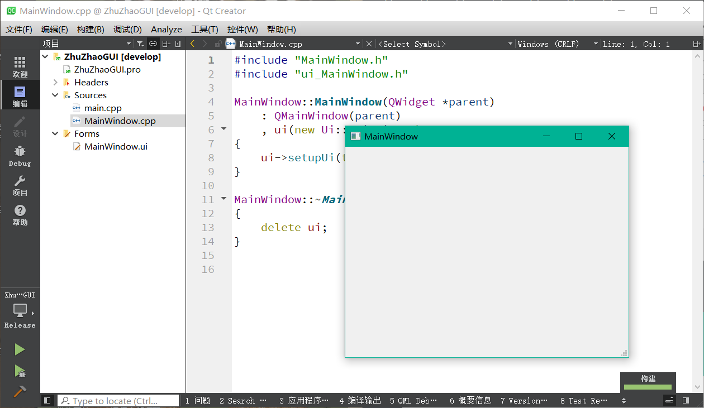

## 烛照源码工程前端QMake管理

我们项目准备好了，接下来开始写代码。写代码之前肯定是先规划我们项目结构和源码如何管理。

烛照：机器视觉光度立体缺陷检测项目，会包含

1. QT软件上位机进行算法效果的调参和演示
2. 使用C++和opencv手撕实现光度立体算法功能

我们可以将算法部分直接写入到我们QT上位机内，也就是不论软件还是算法都写到一起揉成一团，但在实际项目开发中并不是这样的。

我们将前端软件界面和后端算法进行分离解耦，也就是如下结构：

### 1、烛照工程管理结构

前端软件界面我们使用QT/C++编写，工程管理就直接使用QT自带的qmake，也就是pro文件管理。后端光度立体算法做成一个C++算法动态库，然后由我们前端调用这个动态库。算法动态库我们采用CMake管理。

这样由若干好处，例如：

1. 前后端分离，代码易于管理，学习起来也不杂乱
2. 前后端松耦合，不会产生强依赖，两者只靠接口进行链接，所以如果我想复用我的算法动态库，可以直接复用到其它软件上。

至于工程管理，前端我们使用QT自带的qmake，其实我们还可以直接使用VS工程管理，或者使用CMake管理，但使用qmake对于所有级别的学者都可以快速上手，如果使用cmake肯定会涉及一些高阶内容，但我们本教程不打算对cmake进行深入讲解，所以不使用cmake。我们也不适用VS工程直接管理，因为VS的sln文件是个二进制文件，我们无法对其进行版本管理，而qmake是文本文件，是可以方便的进行版本管理的。

对于后端算法的工程管理，我们却采用了cmake，因为后端只有一个算法动态库，cmake很简单，我们也正好简单的入门一下cmake，同时我们同样不采用VS的sln工程文件来管理后端，原因同样是不好进行版本管理。

### 2、创建前端工程

虽然是手把手教程，但创建QT工程应该都会吧，如果第一次使用QT，可以先参照本教程附录内容将QT安装好。

选择创建一个新的桌面应用工程：



填写项目名称ZhuZhao和项目路径：



选择qmake作为构建系统：



修改主界面类的名称，注意我们的类都采用了驼峰命名，即MainWindow，而非mainwindow全小写命名。



选择你的构建套件，我们都使用MSVC套件：



版本控制选择none，点击完成：





至此，我们的前端QT工程就建好了，我们release运行如上图所示，我们只需要在工程中修改代码，来实现我们的上位机软件界面和逻辑即可。

### 3、前端QMake内容解析

QMake是QT自带的工程管理语法，其文件为pro工程文件，我们看烛照的pro工程文件如下：

```cmake
#添加依赖的QT，主要包含core gui widgets
QT       += core gui
greaterThan(QT_MAJOR_VERSION, 4): QT += widgets

#声明C++语言规范版本
CONFIG += c++11
DEFINES += QT_DEPRECATED_WARNINGS

#添加源文件和头文件
SOURCES += \
    ZZConfigWidget/ZZConfigWidget.cpp \
    ZZConfigWidget/ZZOneParamWidget.cpp \
    ZZConfigWidget/ZZProcessThread.cpp \
    ZZListener.cpp \
    ZZLogWidget/ZZLogMessage.cpp \
    ZZLogWidget/ZZLogWidget.cpp \
    ZZThumWidget/HThumbnailList.cpp \
    ZZThumWidget/LitImgItemWidget.cpp \
    ZZThumWidget/VThumbnailList.cpp \
    ZZViewWidget/CustomGraphicsView.cpp \
    ZZViewWidget/CustomImageItem.cpp \
    ZZViewWidget/CustomImageView.cpp \
    main.cpp \
    MainWindow.cpp

HEADERS += \
    MainWindow.h \
    ZZConfigWidget/ImageConvert.h \
    ZZConfigWidget/ZZConfigWidget.h \
    ZZConfigWidget/ZZOneParamWidget.h \
    ZZConfigWidget/ZZProcessThread.h \
    ZZListener.h \
    ZZLogWidget/ZZLogMessage.h \
    ZZLogWidget/ZZLogWidget.h \
    ZZThumWidget/HThumbnailList.h \
    ZZThumWidget/LitImgItemWidget.h \
    ZZThumWidget/VThumbnailList.h \
    ZZViewWidget/CustomGraphicsView.h \
    ZZViewWidget/CustomImageItem.h \
    ZZViewWidget/CustomImageView.h

#添加资源文件
RESOURCES += \
    ZhuzhaoGuiRes.qrc

#配置opencv库
INCLUDEPATH += S:/OPENCV/opencv_4.5.5_install/opencv/build/include
Debug: {
LIBS += -lS:/OPENCV/opencv_4.5.5_install/opencv/build/x64/vc15/lib/opencv_world455d
}
Release: {
LIBS += -lS:/OPENCV/opencv_4.5.5_install/opencv/build/x64/vc15/lib/opencv_world455
}

#配置我们自己实现的光度立体算法库
INCLUDEPATH += $$PWD/../PhotometricStereo
Debug: {
    LIBS += -l$$PWD/../bin/PhotometricStereo
}
Release: {
    LIBS += -l$$PWD/../bin/PhotometricStereo
}

#配置生成路径，将我们的结果输出产物输出到bin文件夹内，方便管理
CONFIG(debug, debug|release){
    DESTDIR = $$PWD/../bin
}else{
    DESTDIR = $$PWD/../bin
}

#设置图标
RC_ICONS = zhuzhao_logo.ico

#添加翻译文件
TRANSLATIONS += language_ch.ts

# Default rules for deployment.
qnx: target.path = /tmp/$${TARGET}/bin
else: unix:!android: target.path = /opt/$${TARGET}/bin
!isEmpty(target.path): INSTALLS += target

```

其实没什么语法规则，大家直接对着源码直接看注释即可。
