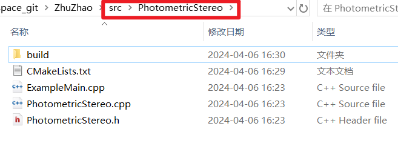
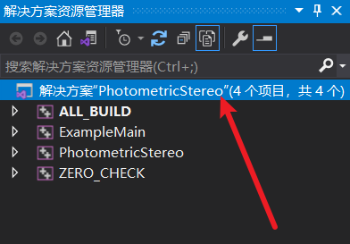
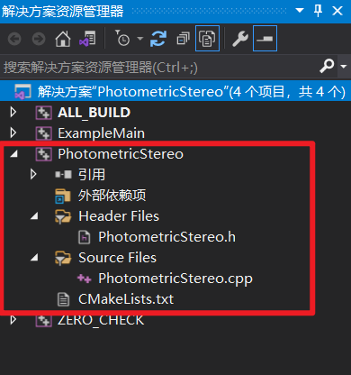
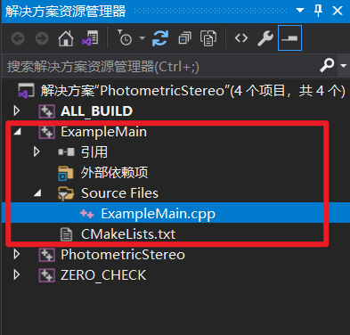
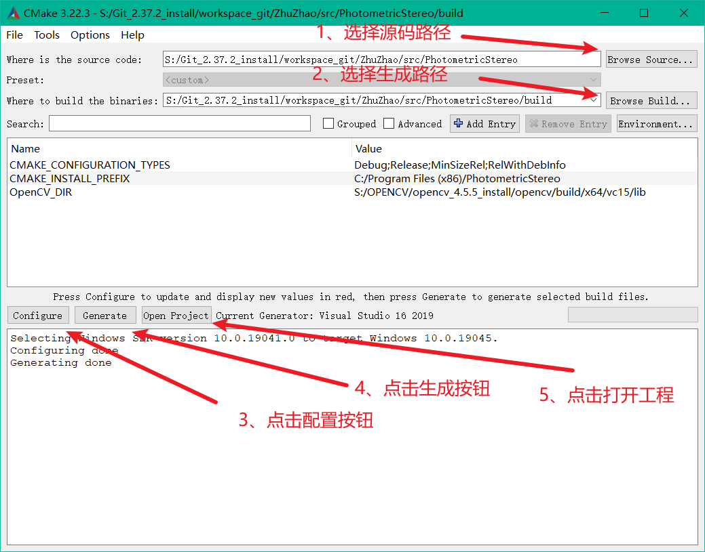
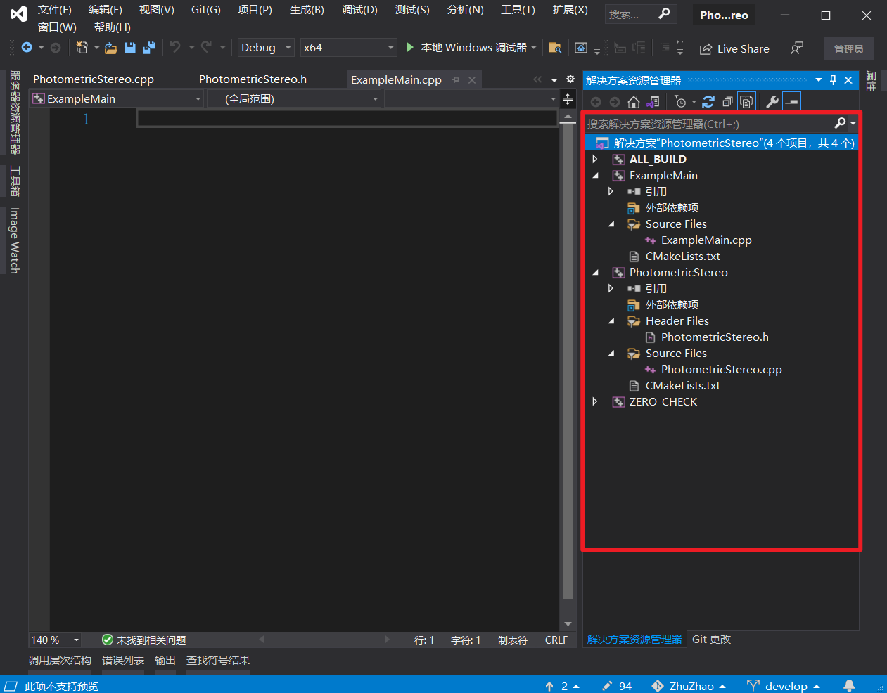

## 烛照源码工程后端创建与CMake管理

后端工程是CMake管理，CMake是通过其cmake语言，由我们手动编写来管理我们的源代码，很多东西用文字很难表述，我们直接手把手实战一下就会了：



首先我们在烛照项目路径的src目录下，创建了一个PhotometricStereo文件夹，用来存储我们算法部分的代码。算法部分分为两个部分：

1. PhotometricStereo.h和PhotometricStereo.cpp两个文件组成的算法动态库PhotometricStereo.dll
2. 只有算法动态库我们很难查看算法效果，我们还需要一个示例程序，即ExampleMain.cpp，它自己组成一个exe可执行程序，依赖算法动态库PhotometricStereo.dll，用来展示效果

工程管理使用cmake，所以我们需要手动使用txt在源码根目录，也就是src/PhotometricStereo目录内创建一个CMakeLists.txt，注意，为什么必须是CMakeLists.txt？因为CMake在编译工程的时候，只会寻找CMakeLists.txt文件进行编译。

我们的CMakeLists.txt编写内容如下：

```cmake
# S.0工程创建
CMAKE_MINIMUM_REQUIRED(VERSION 3.22)
PROJECT(PhotometricStereo)
set(CMAKE_CXX_STANDARD 11)

# S.1寻找第三方库
FIND_PACKAGE(OpenCV REQUIRED)

# S.2创建光度立体算法动态库
FILE(GLOB 
	DLL_SRCS
	PhotometricStereo.cpp 
	PhotometricStereo.h
	)

add_library(PhotometricStereo SHARED ${DLL_SRCS})
TARGET_LINK_LIBRARIES(PhotometricStereo ${OpenCV_LIBS})

# S.3创建光度立体算法的示例程序
FILE(GLOB
	EXAMPLE_SRCS
	ExampleMain.cpp 
	)

add_executable(ExampleMain ${EXAMPLE_SRCS})
TARGET_LINK_LIBRARIES(ExampleMain ${OpenCV_LIBS} PhotometricStereo)
```

我们不给大家介绍CMake的语法规则，因为我们整个学习项目的CMake代码只有这么一点，我们这个项目只带大家学习一下CMake的原理和使用即可。所以给大家介绍下每行代码的功能：

#### 3.1、工程创建

```cmake
# S.0工程创建
CMAKE_MINIMUM_REQUIRED(VERSION 3.22)
PROJECT(PhotometricStereo)
set(CMAKE_CXX_STANDARD 11)
```

我们使用CMAKE_MINIMUM_REQUIRED强调了我们CMake的最低版本，因为不同版本的CMake虽然是相互兼容的，但避免大家使用的版本过低，我们通常会使用CMAKE_MINIMUM_REQUIRED来检查一下最低版本。如果版本低于3.22，是无法进行cmake编译的。

PROJECT(PhotometricStereo)声明了解决方案名称，就叫PhotometricStereo，这个解决方案名称和VS中的解决方案名称是对应的：



set(CMAKE_CXX_STANDARD 11)设置了C++的版本，因为C++有11、14、17、20等等若干版本，有些高级语法只在较高版本的C++中支持，所以我们设定C++的版本是C++11。

#### 3.2、创建第三方库

```cmake
# S.1寻找第三方库
FIND_PACKAGE(OpenCV REQUIRED)
```

我们的算法库依赖于opencv，所以我们需要使用FIND_PACKAGE来寻找opencv库。FIND_PACKAGE会在系统目录内朝查找所有路径，在里面寻找opencv库，所以想让FIND_PACKAGE成功找到opencv库的话，我们必须预先在系统环境目录内配置好opencv的路径。

#### 3.3、创建算法动态库目标

```cmake
# S.2创建光度立体算法动态库
FILE(GLOB 
	DLL_SRCS
	PhotometricStereo.cpp 
	PhotometricStereo.h
	)

add_library(PhotometricStereo SHARED ${DLL_SRCS})
TARGET_LINK_LIBRARIES(PhotometricStereo ${OpenCV_LIBS})
```

FILE命令会将我们所罗列的所有文件，即	PhotometricStereo.cpp和PhotometricStereo.h两个文件，存放到文件列表DLL_SRCS中。add_library则将DLL_SRCS文件列表的所有文件，都加入到了PhotometricStereo目标中，这个对应我们VS中的项目名称：



我们编译PhotometricStereo这个项目，会生成PhotometricStereo.dll动态库。

TARGET_LINK_LIBRARIES是链接第三方库，我们说过很多遍了，光度立体算法是依赖opencv算法动态库的，所以我们调用TARGET_LINK_LIBRARIES，为PhotometricStereo链接上我们前面调用FIND_PACKAGE所找到的opencv动态库。

#### 3.4、创建光度立体算法示例程序

```cmake
# S.3创建光度立体算法的示例程序
FILE(GLOB
	EXAMPLE_SRCS
	ExampleMain.cpp 
	)

add_executable(ExampleMain ${EXAMPLE_SRCS})
TARGET_LINK_LIBRARIES(ExampleMain ${OpenCV_LIBS} PhotometricStereo)
```

这里和前面不同的是，我们使用add_executable，创建了一个ExampleMain目标，编译这个项目，会生成一个ExampleMain.exe文件，是一个可执行文件。

我们使用TARGET_LINK_LIBRARIES，为ExampleMain增加了依赖库，依赖opencv和PhotometricStereo两个动态库。



### 4、编译生成后端工程项目

前面我们写好了cmake代码，接下来做什么呢，编译运行cmake，生成VS工程。

首先打开我们的CMake-GUI，如下图操作：



1. 选择源码路径，就是我们根CMakeLists.txt文件所在路径

2. 选择输出路径，一般是在源代码的统计目录，创建一个新的名为build的文件夹，但其实路径和名称可以是任意的

3. 点击配置按钮

4. 点击生成按钮

5. 点击打开工程，会直接打开VS工程

   

至此，我们后端的项目工程也搭建起来了，可以愉快的写后端的算法代码了。