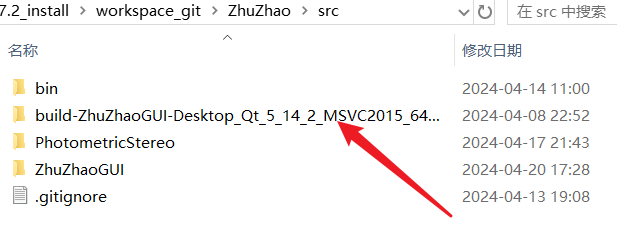
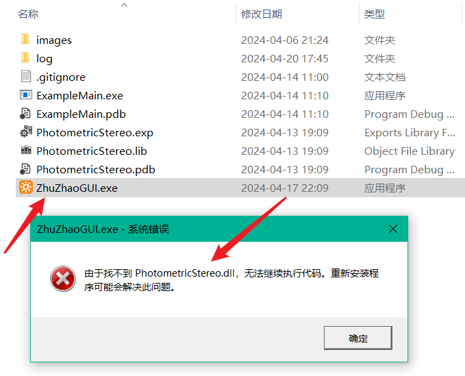
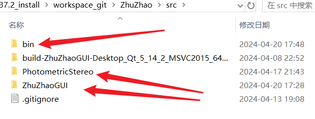

## 源码生成目录管理

在我们一个项目中，必然要涉及生成目录的管理，所以单独拿出来和大家说一下。

我们知道我们烛照的界面GUI的编译运行产物是zhuzhaoGUI.exe，这个exe正常默认生成目录是在QT自动生成的影子文件夹内：



我们还有一个后端算法库，它的产物是PhotometricStereo.dll动态库，这个dll的默认生成路径时在CMake的build生成目录下。

这两个目录并不是一个路径，会导致什么问题呢？exe运行，会在其同级目录下寻找它依赖的动态库，我们的zhuzhaoGUI.exe依赖PhotometricStereo.dll，如果按照上面所说的默认目录，我们直接运行zhuzhaoGUI.exe，会报错如下：



解决这个问题也很简单，我们手动将PhotometricStereo.dll动态库拷贝到zhuzhaoGUI.exe的运行目录即可。

但这样每次都重复操作太麻烦了，而且两个的生成目录分散，直观上就感觉很不爽，所以我们要将这两个生成到同一个路径。怎么操作呢？



我们将ZhuZhaoGUI和PhotometricStereo两个源码文件夹的同级目录下的bin文件夹作为统一的生成目录。在前端QMake中设置如下：

```cmake
#配置生成路径，将我们的结果输出产物输出到bin文件夹内，方便管理
CONFIG(debug, debug|release){
    DESTDIR = $$PWD/../bin
}else{
    DESTDIR = $$PWD/../bin
}
```

后端CMake中配置如下：

```cmake
# 定义binary和library路径
set(ZZ_ROOT ${CMAKE_CURRENT_SOURCE_DIR} CACHE PATH "zhuzhao root")
set(ZZ_DEBUG_BUILD_DIR "${ZZ_ROOT}/../bin" CACHE PATH "Debug Build Dir")
set(CMAKE_RUNTIME_OUTPUT_DIRECTORY ${ZZ_DEBUG_BUILD_DIR})
set(CMAKE_RUNTIME_OUTPUT_DIRECTORY_DEBUG ${ZZ_DEBUG_BUILD_DIR})
set(CMAKE_RUNTIME_OUTPUT_DIRECTORY_RELEASE ${ZZ_DEBUG_BUILD_DIR})
set(CMAKE_RUNTIME_OUTPUT_DIRECTORY_RELWITHDEBINFO ${ZZ_DEBUG_BUILD_DIR})
set(CMAKE_LIBRARY_OUTPUT_DIRECTORY ${ZZ_DEBUG_BUILD_DIR})
set(CMAKE_LIBRARY_OUTPUT_DIRECTORY_DEBUG ${ZZ_DEBUG_BUILD_DIR})
set(CMAKE_LIBRARY_OUTPUT_DIRECTORY_RELEASE ${ZZ_DEBUG_BUILD_DIR})
set(CMAKE_LIBRARY_OUTPUT_DIRECTORY_RELWITHDEBINFO ${ZZ_DEBUG_BUILD_DIR})
set(CMAKE_ARCHIVE_OUTPUT_DIRECTORY ${ZZ_DEBUG_BUILD_DIR})
set(CMAKE_ARCHIVE_OUTPUT_DIRECTORY_DEBUG ${ZZ_DEBUG_BUILD_DIR})
set(CMAKE_ARCHIVE_OUTPUT_DIRECTORY_RELEASE ${ZZ_DEBUG_BUILD_DIR})
set(CMAKE_ARCHIVE_OUTPUT_DIRECTORY_RELWITHDEBINFO ${ZZ_DEBUG_BUILD_DIR})
```

就是这两部分代码，将我们的生成目录进行了统一。

