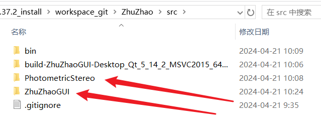
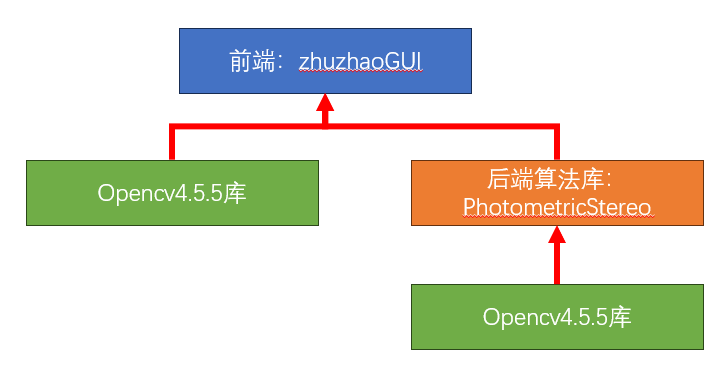
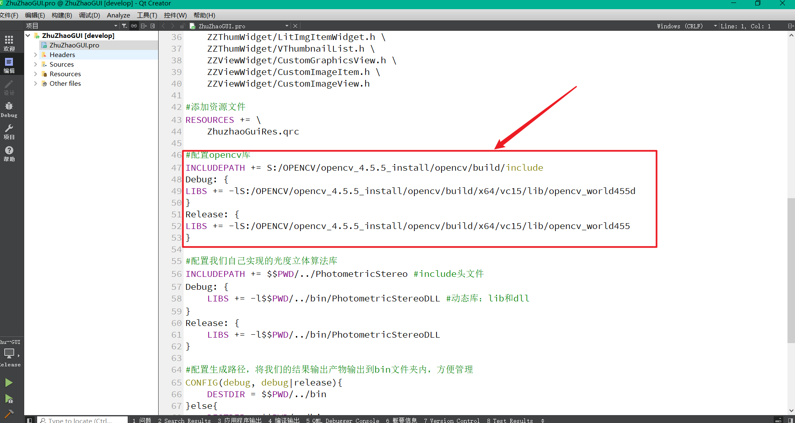
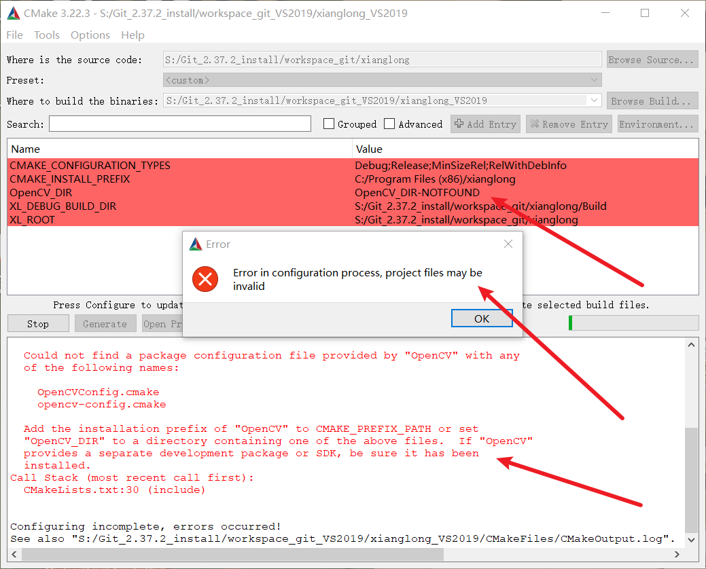
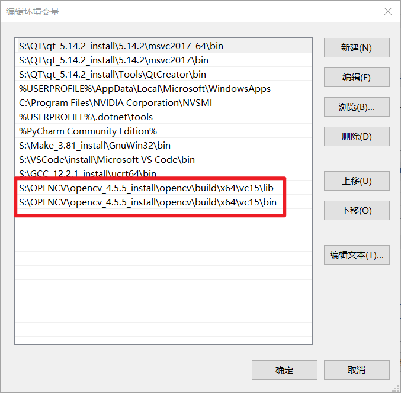
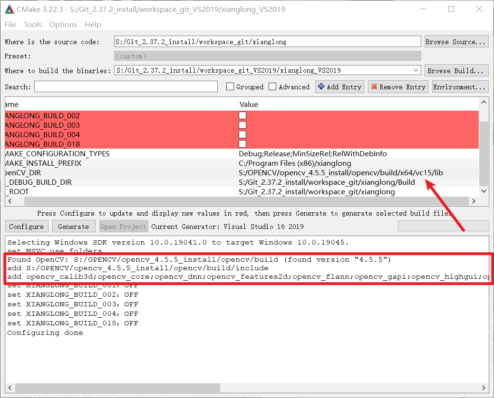

## 烛照源码的运行

我们本文介绍一下如何将源码运行起来。其实很简单，但学该项目的可能很多都是小白，对于动态库配置、QT配置、Opencv配置可能都搞不清楚，所以写一篇文档教程。

### 1、环境配置

首先，我们的源码环境是：

1. Windows 10系统
2. C++11语言标准
3. QT 5.14.2版本
4. opencv 4.5.5版本
5. VS 2019
6. CMake3.22.3

环境版本希望大家能和上面的尽量保持一致，如果你的环境和我们上述环境有不一致的地方，那可能源码的运行会有一些问题，我们默认你使用不同版本的环境，那你就有能力解决这些版本问题。

首先我们要做的就是安装VS2019和QT，这个我没有写过什么博客，网上博客一大推，就不单独介绍了。QT 5.14.2版本的离线安装包，在网上各大源码网站可能已经找不到了，我这里有一份5.14.2版本的百度网盘，大家可以按需下载：

> 链接：https://pan.baidu.com/s/1Db9yfQ8jbnzn25yvCGFiXw?pwd=v0j7 
> 提取码：v0j7

关于Opencv库的安装，可以看我写的这三篇文章，重点看第一篇，其它两篇如果初学则用不上：

[【opencv源码解析0.1】VS如何优雅的配置opencv环境](https://www.roundvision.cc/opencv/sherdopencv/%e3%80%90opencv%e6%ba%90%e7%a0%81%e8%a7%a3%e6%9e%900-1%e3%80%91vs%e5%a6%82%e4%bd%95%e4%bc%98%e9%9b%85%e7%9a%84%e9%85%8d%e7%bd%aeopencv%e7%8e%af%e5%a2%83/)

[【opencv源码解析0.2】如何编译opencv库源码](https://www.roundvision.cc/opencv/sherdopencv/%e3%80%90opencv%e6%ba%90%e7%a0%81%e8%a7%a3%e6%9e%900-2%e3%80%91%e5%a6%82%e4%bd%95%e7%bc%96%e8%af%91opencv%e5%ba%93%e6%ba%90%e7%a0%81/)

[【opencv源码解析0.3】调试opencv源码以及使用cmake来管理项目](https://www.roundvision.cc/opencv/sherdopencv/%e3%80%90opencv%e6%ba%90%e7%a0%81%e8%a7%a3%e6%9e%900-3%e3%80%91%e8%b0%83%e8%af%95opencv%e6%ba%90%e7%a0%81%e4%bb%a5%e5%8f%8a%e4%bd%bf%e7%94%a8cmake%e6%9d%a5%e7%ae%a1%e7%90%86%e9%a1%b9%e7%9b%ae/)

CMake安装就更简单了，如果不会请直接csdn。

最后，如果想完美的理解我们项目的搭建和结构，可能需要你理解动态库和CMake，如果不理解，去学我们烛照项目的第二章的视频，烛照项目的第二章，其实就是我们完整的龙门项目。

龙门项目是教C++基础的，视频路径：[https://www.bilibili.com/video/BV1YG411e7D5](https://www.roundvision.cc/?golink=aHR0cHM6Ly93d3cuYmlsaWJpbGkuY29tL3ZpZGVvL0JWMVlHNDExZTdENQ==)

### 2、烛照环境配置

烛照源码结构分前后端：



前端zhuzhaoGUI，直接进去，点击zhuzhaoGUI.pro工程文件运行即可。

后端是PhotometricStereo，也就是光度立体算法动态库，需要我们执行CMake编译生成VS工程才可以。步骤参考[3.3后端工程创建与CMake管理.md](3.3后端工程创建与CMake管理.md)

大部分同学项目跑不起来的根本原因，都是库没有配置好，我们的项目的动态库依赖关系如下图所示：



我们烛照前端软件界面，依赖opencv4.5.5的动态库，同时也依赖后端PhotometricStereo算法库。而PhotometricStereo算法库也依赖opencv4.5.5动态库。所以如果你的项目没有跑起来，需要确认opencv动态库相关配置。

关于opencv动态库配置的地方有两个，一个是前端界面的pro配置文件内，一个是CMake。

#### 2.1pro配置Opencv库

这一部分详细介绍见[3.2烛照源码前端工程创建与QMake管理.md](./3.2烛照源码前端工程创建与QMake管理.md)。

我们在ZhuZhaoGUI.pro中，通过绝对路径来配置的opencv库，所以拿到项目，首先需要修改下图所示的库路径，改为你本地的opencv库路径：



#### 2.2Cmake配置Opencv库

CMake是通过findPack自动查找Opencv库的，而自动查找成功的前提是在Windows系统路径内配置好了opencv库的路径，CMake才可以编译成功。

如果没有在系统路径配置好，CMake便无法自动找到Opencv库，导致CMake生成失败，类似下图所示：



我们CMake是如何自动查找我们电脑本地的Opencv库的呢？CMake代码位于xianglong/CMakeModules/XLAddDepsLibs.cmake

```cmake
# 链接到opencv库
#set(OpenCV_DIR "S:/OpenCV_install/opencv")
find_package(OpenCV REQUIRED)
include_directories(${OpenCV_INCLUDE_DIRS})#头文件路径
link_directories(${OpenCV_LIBRARIES})#库文件路径

message(STATUS "add ${OpenCV_INCLUDE_DIRS}")
message(STATUS "add ${OpenCV_LIBRARIES}")
```

具体代码含义大家自行百度，可以百度：cmake如何添加opencv库等等。

那这段代码没有找到我们本地的opencv库，大概率就是因为我们本地没有配置好opencv库的路径，导致其找不到，所以只需要在windows的系统变量中添加我们本地的opencv库路径，将其配置好即可，如我的系统变量：



配置好后，重启电脑，重新CMake：



可以看到已经能找到Opencv库，并编译通过了！

### 3、库的依赖顺序

我们源码运行的常规顺序是，拿到源码，需要先编译后端算法库，将烛照项目依赖的光度立体算法动态库编译成功，然后再去编译前端算法库。

因为前端算法库是依赖于后端算法库的，所以要先编译后端算法库。


