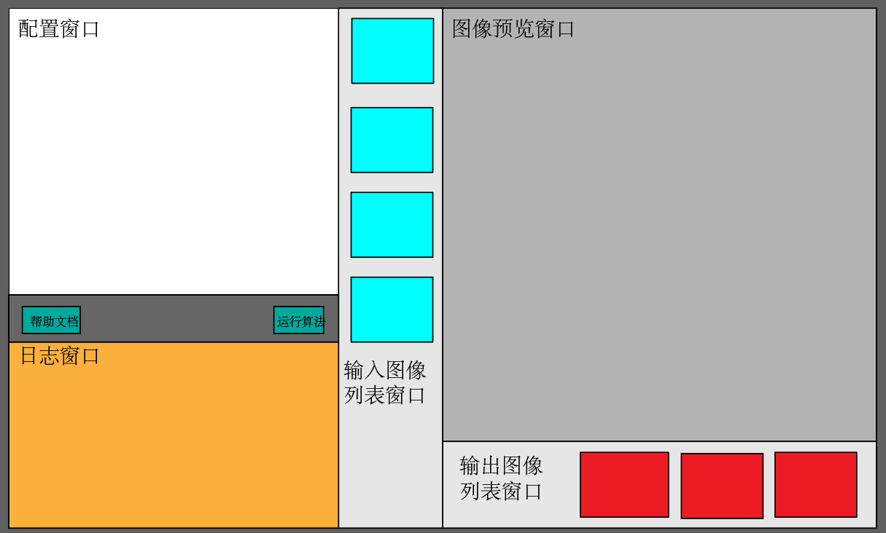
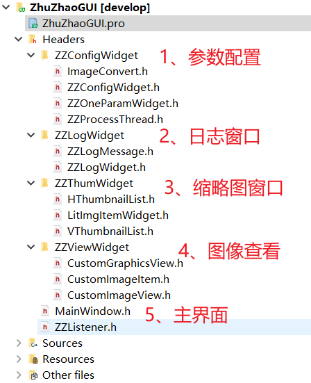

## 烛照前端主界面设计

我们开始实现前端软件的界面了，我们本文不考虑界面的美化，仅考虑界面的布局和逻辑功能实现。

这个其实没有什么好说的，纯看个人怎么设计，想怎么设计怎么设计，所以，我大体设计的界面如下：

界面美丑就不纠结了，颜色到时也不会用上图的颜色，上图仅是设计一下布局。正常软件开发过程中，会有界面设计工程师给你比上图要精美好看的多的设计样式稿，我们软件开发人员只需要按照样式稿去实现就可以了。

我们采用上图的布局：

1. 配置窗口，用来配置我们的算法，主要就是一些算法的输入参数，例如光度立体的角度参数等等。
2. 配置窗口下面两个按钮，一个是帮助文档，一个是运行算法
3. 日志窗口，用来显示我们的日志打印，有利于我们调试或者查看运行步骤
4. 输入图像列表，我们要选择若干张（其实是四张）不同角度拍摄的同一物体的图像，这是我们光度立体算法的需求输入，我们会显示在输入图像列表，点击列表任意一张，都会将图像显示在右侧的图像预览窗口
5. 图像预览窗口：可以放大缩小图像并查看图像的细节
6. 输出图像列表，当我们点击算法运行后，我们写的光度立体算法会输出若干个计算图像，例如反照率图像、高度图像、梯度图像等等。

因为上图画的太过抽象，所以给大家放一张最终效果图对照查看：

界面的设计其实就是对界面架构的理解，对各种功能模块的拆分和封装。例如在上图的设计中，我们既然将参数配置搞成了一个单独的区域，和图像显示和图像列表以及日志界面分离了，那参数配置界面肯定就是一个独立的类了。

所以根据我们的界面设计，可以很容易的得到我们的工程目录结构，如上图所示：

1. 参数配置界面，文件夹内包含界面类，子线程算法执行类
2. 日志窗口：包含日志界面类，日志功能类
3. 缩略图窗口：包含缩略图列表类
4. 图像查看窗口：包含图像查看器类
5. 主界面：包含MainWindow类

所以我们的日常开发流程，一般也都是先思考功能，根据功能设计界面，在界面设计时就要考虑实现方案和分割，然后再对界面进行分割，以及对每一个界面进行抽象，实现我们的类。

然后一般都是将同类功能的源码文件放到一个文件夹内，这样也就实现了我们的整个项目层次结构。

