## QT的.ui文件的作用以及ui文件的本质

我们前面讲的时候遇到了很多次.ui文件，.ui文件是QT独有的，但不是必须的。本节视频给大家把QT的ui文件讲明白，相信很多QT开发东西你就豁然开朗了，然后我们再将如何不依赖ui文件进行QT界面开发。

为什么要不依赖ui文件开发，因为ui文件可维护性差，可阅读性也差，ui文件就是为了给新手使用的。常规项目都是不使用ui文件的，而是使用纯代码完成界面开发。

### 1、ui文件的使用及本质

 现在我们来说一下ui的本质。我们前面说过很多遍了，QT是一个C++库，它没有什么特殊的。如果有些东西你理解不了，那不是QT库难，而是C++没有理解到位。所以我们讲一下ui的本质，大家就能理解这是个什么东西了。

我们先演示一下ui文件的使用。我们创建一个空白项目：

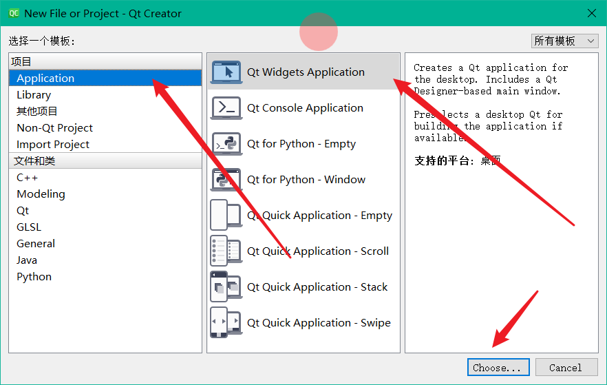

选择QT软件项目，点击下一步。

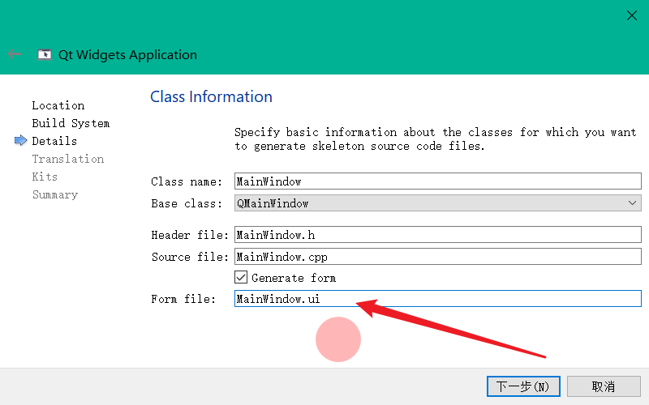

勾选Generate form，也就是生成ui文件，也可以不勾选，正如我们前面说的，ui文件不是QT软件开发必须的，我们本节演示ui文件的使用和作用，所以勾选上。进行下一步。

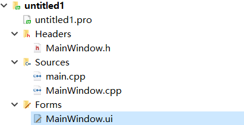

创建项目完成，我们得到上图的项目目录，有四个文件，我们先打开MainWindow.ui文件，我们随意给它拖放了几个控件：

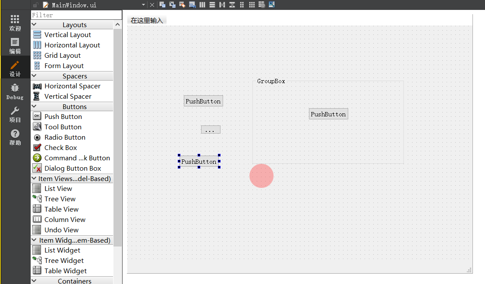

运行，效果如下：

现在主题来了，UI文件是如果发挥作用的？UI文件其实本质是一个Xml文件，用来描述界面的：

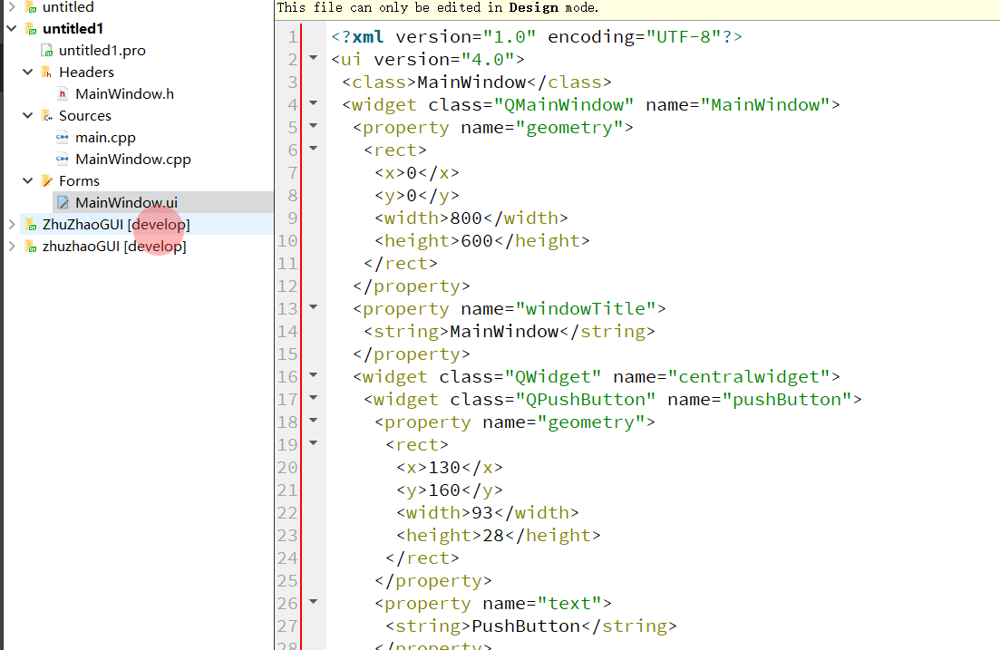

QT会解析这个xml，然后来生成我们所眼见得，可拖拽得，可视化得界面设计器，同时界面设计器发生修改时，又会将修改写入到xml序列化文件中。

QT库具备强大的静态编译系统和反射功能，ui文件就是一种对界面得反射，通过序列化描述语言，反射生成界面得过程。反射得产物是什么呢？是从xml文件，反射为了一个Ui_MainWindow类，就是下图得ui指针。

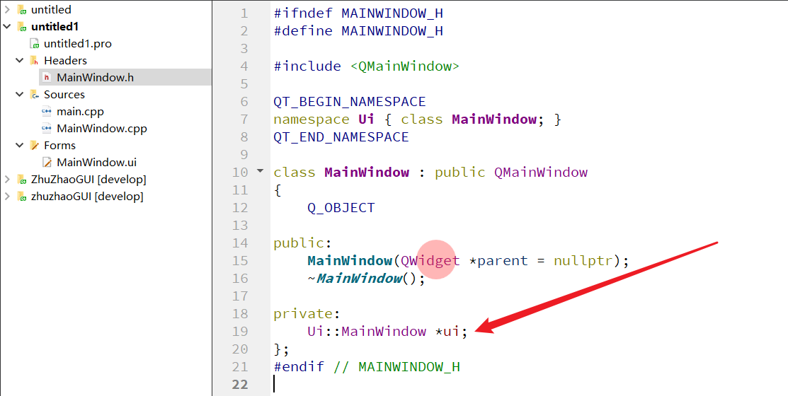

我们点击这个类对象，来看看它得声明，他的声明位于ui_MainWindow.h中。

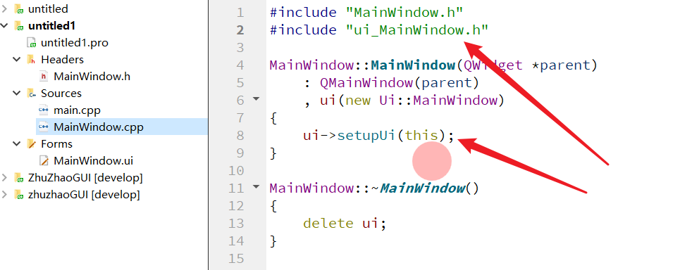

进入头文件，来看看类是如何实现得：

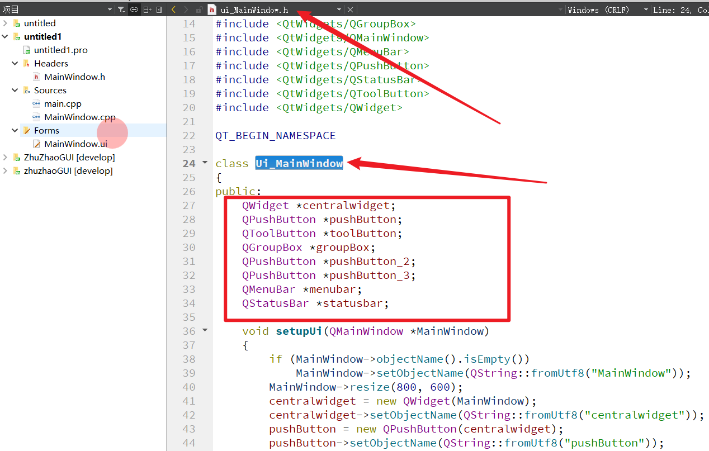

这个通过xml反射生成ui_MainWindow类内，包含了我们在设计界面上生成得各种控件。并且是Public属性的。

这使得我们可以直接在代码中进行如下格式的访问控件：

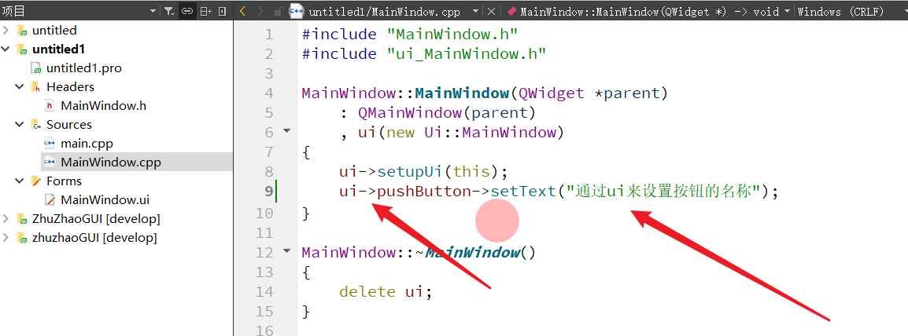

运行效果如下：

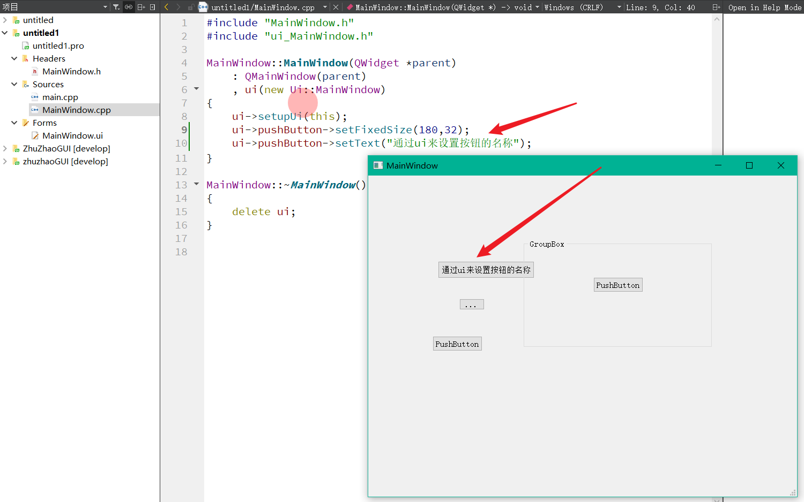

不知道你现在是否理解了，QT的ui文件的本质，以及其是如何发挥作用的？

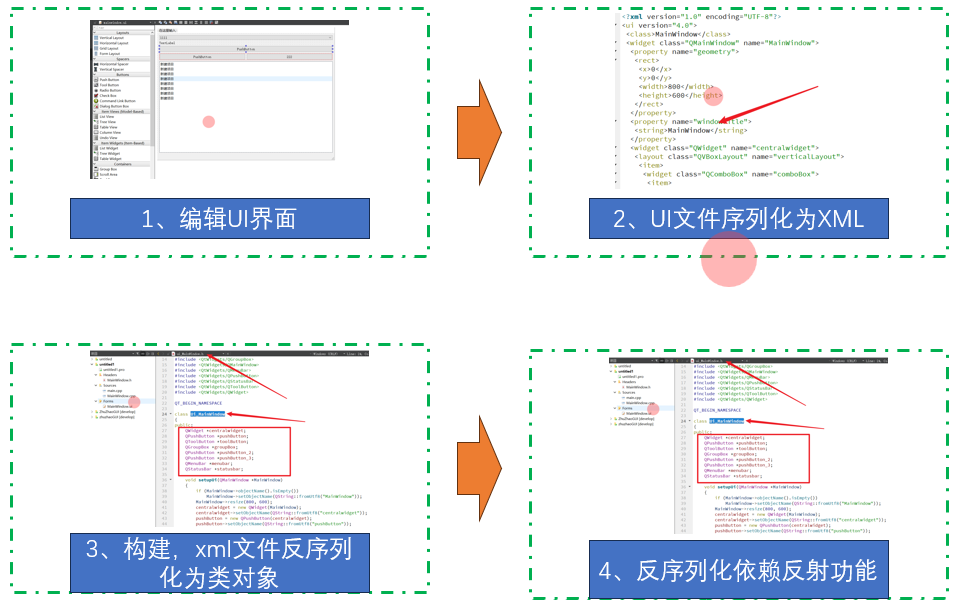

**来总结一下，正如我们前面说，ui文件是QT独有的，但并不是必须的，因为其本质还是我们在界面设计完毕，生成xml序列化文件，然后通过反射生成一个类，完成反序列化过程。类中包含了所有控件的指针，我们本质还是通过这个类来访问控件。**

下一讲我们给大家讲解如何去除ui文件，来手写QT界面。

