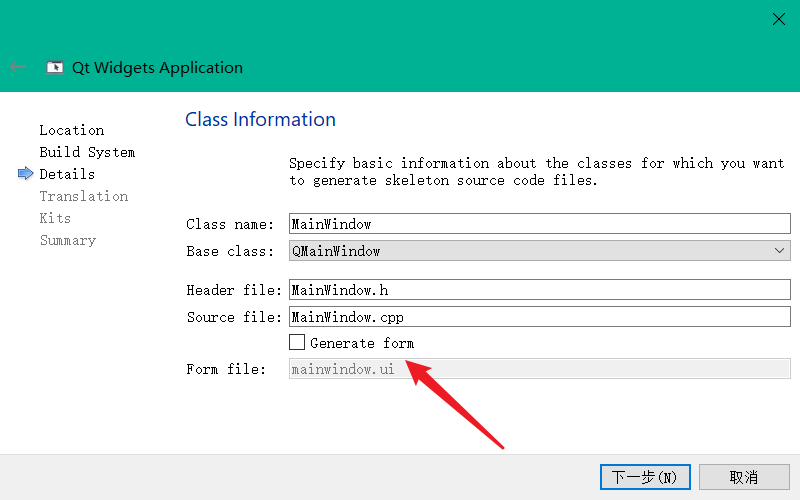
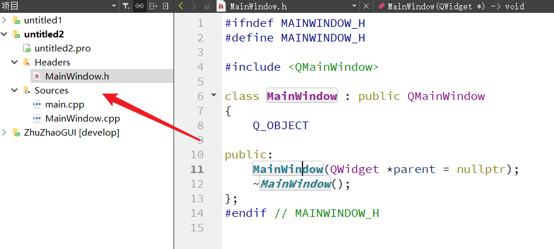

## QT如何去除ui文件进行编程

我们在上一篇带大家洞悉了QT的ui文件的本质。总结来说，就是通过QT的ui设计界面，生成xml序列化文件，这就是ui文件的本地，然后在编译工程时，QT又将xml格式的ui文件进行反射解析，生成一个类，将这个类存到了我们对应界面类的private私有成员中，通过指针得以访问。

我们在上一篇使用ui文件生成了如下界面：


代码就是通过这两行配合ui文件来实现对按钮的设置的：

```c++
ui->pushButton->setFixedSize(180,32);
ui->pushButton->setText("通过ui来设置按钮的名称");
```

### 1、去除ui文件，自行生成按钮并设置

重新新建一个工程，流程和前文一样，唯一不同就是不勾选生成ui文件按钮：


生成的项目结构就仅有.h头文件和.cpp源文件了：



修改源码如下：

MainWindow.h：

```c++
#ifndef MAINWINDOW_H
#define MAINWINDOW_H

#include <QMainWindow>
#include <QPushButton>

class MainWindow : public QMainWindow
{
    Q_OBJECT

public:
    MainWindow(QWidget *parent = nullptr);
    ~MainWindow();

private:
    QPushButton* m_pBtn;
};
#endif // MAINWINDOW_H
```

MainWindow.cpp：

```c++
#include "MainWindow.h"
#include <QLayout>

MainWindow::MainWindow(QWidget *parent)
    : QMainWindow(parent)
    , m_pBtn(Q_NULLPTR)
{
    this->setFixedSize(500,500);
    //创建按钮对象
    m_pBtn = new QPushButton(this);
    m_pBtn->setFixedSize(120,32);
    m_pBtn->setText("通过ui来设置按钮的名称");
    //添加布局设置
    QVBoxLayout* pMainLayout = new QVBoxLayout(this);
    pMainLayout->addWidget(m_pBtn);
    pMainLayout->addStretch();
    QWidget* pCenterWidget = new QWidget(this);
    pCenterWidget->setLayout(pMainLayout);

    this->setCentralWidget(pCenterWidget);
}

MainWindow::~MainWindow()
{
}
```

具体效果大家上手尝试即可，或者观看更为详细的视频教程。