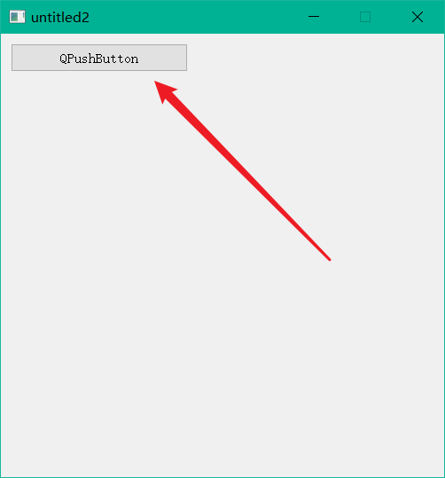
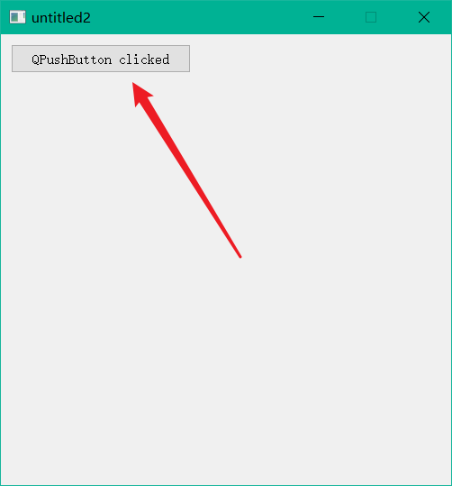
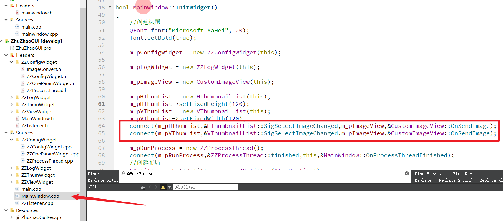
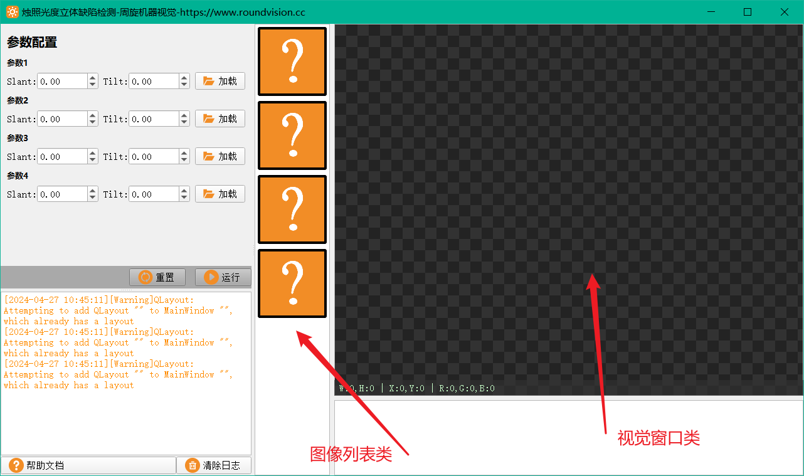
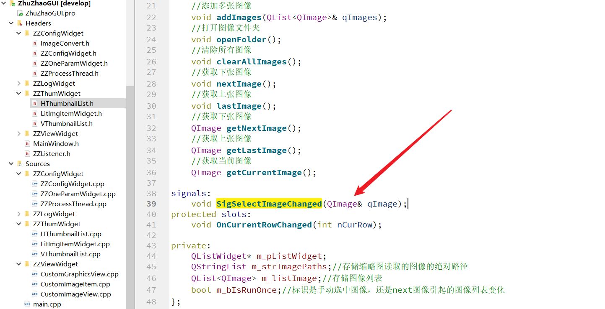
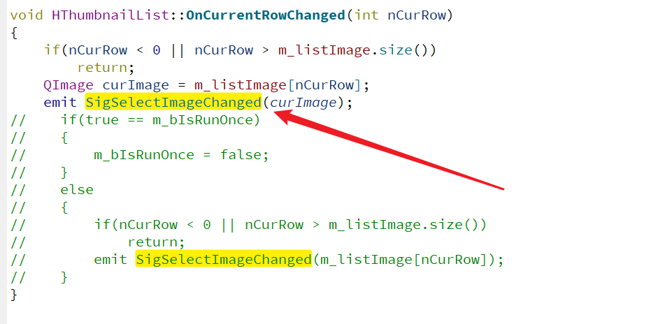
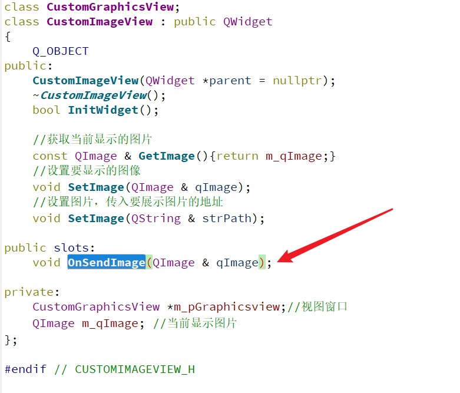

## QT的信号与槽

QT的信号槽是他的一大特色，如果你是纯小白那你可能有所不理解，但正如我们前面所说，QT就是一个C++前端界面库。它的任何东西你不理解，并不是QT这个库难，而是你对它的C++原理不清楚，才觉得难。

所以本文给大家讲解QT的信号槽，如果你觉的不能理解，就要多从C++的角度去思考。

### 1、信号与槽的使用

我们将前文的例程做修改，添加一个按钮的信号槽，代码修改如下：

```c++
#ifndef MAINWINDOW_H
#define MAINWINDOW_H

#include <QMainWindow>
#include <QPushButton>

class MainWindow : public QMainWindow
{
    Q_OBJECT

public:
    MainWindow(QWidget *parent = nullptr);
    ~MainWindow();

protected slots:
    void OnBtnClicked();

private:
    QPushButton* m_pBtn;
};
#endif // MAINWINDOW_H

```

源文件：

```c++
#include "MainWindow.h"
#include <QLayout>

MainWindow::MainWindow(QWidget *parent)
    : QMainWindow(parent)
    , m_pBtn(Q_NULLPTR)
{
    this->setFixedSize(500,500);
    //创建按钮对象
    m_pBtn = new QPushButton(this);
    m_pBtn->setFixedSize(200,32);
    m_pBtn->setText("QPushButton");
    //添加布局设置
    QVBoxLayout* pMainLayout = new QVBoxLayout(this);
    pMainLayout->addWidget(m_pBtn);
    pMainLayout->addStretch();
    QWidget* pCenterWidget = new QWidget(this);
    pCenterWidget->setLayout(pMainLayout);

    this->setCentralWidget(pCenterWidget);

    //创建信号槽
    connect(m_pBtn,&QPushButton::clicked,this,&MainWindow::OnBtnClicked);
}

MainWindow::~MainWindow()
{
}

void MainWindow::OnBtnClicked()
{
    //在槽函数内做任何操作
    m_pBtn->setText("QPushButton clicked");
}
```

运行效果，点击按钮前：



点击按钮，按钮发送信号QPushButton::clicked，connect将信号与槽OnBtnClicked链接，所以进入槽函数OnBtnClicked，修改按钮文字：



### 2、自定义信号槽的使用



上图为两个自定义界面类的信号槽链接函数。左边是缩略图列表类，右边是视觉窗口类。



该信号槽的作用就是，点击图像缩略图列表任意一张图像，视觉窗口将放大显示该图像。

缩略图列表的信号声明：



缩略图列表的信号调用：


视觉窗口的槽函数的声明：


