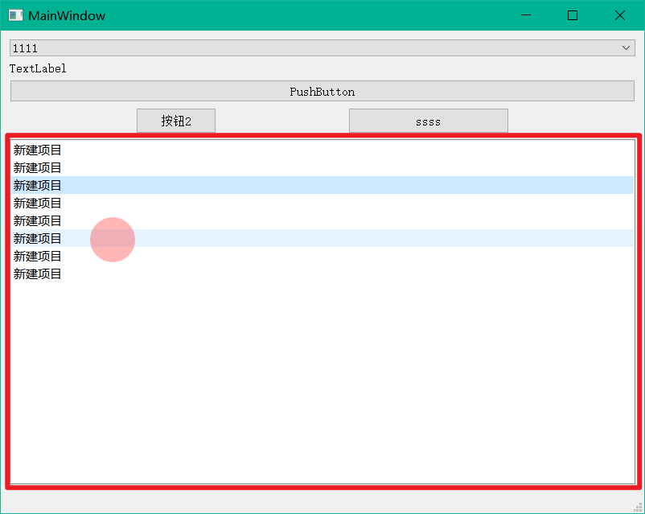
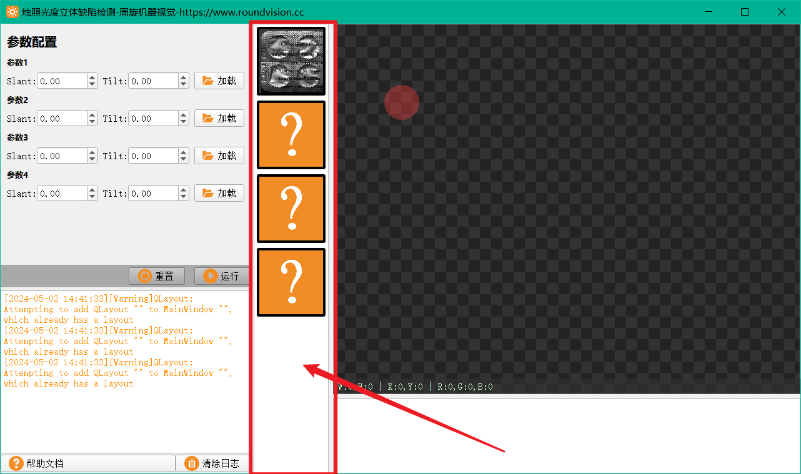

## 使用QListWidget实现缩略图列表控件



如上图所示，正常的QListWidget是非常朴素的，我们希望基于QListWidget实现我们任意样子和功能的图像列表，例如我们本节要实现的烛照的缩略图列表，如下图所示：



实现步骤非常简单，一个QListWidget是由两个部分组成的，分别是

1. QListWidget：列表本身
2. QListWidgetItem：列表所绑定的元素

那我们所想实现的缩略图列表，其实是希望列表所绑定的元素可以以我们想要的形式展示出来：

1. 当图片为空是，图像为一个问好
2. 当有图像时，则显示图像
3. 图像没有被选中时，显示黑色边框
4. 图像被选中时，显示红色边框

除了，这些，我们甚至可以扩展：

1. 在图像下方或者上方或者任意位置显示图像的名称
2. 图像上有一个按钮，点击可以清空图像
3. 等等任意你想实现的功能

如何实现呢？QListWidget为我们提供了一个函数接口setItemWidget，可以为每个QListWidgetItem绑定我们自定义的QWidget，来实现我们上述任意想要实现的功能。

### 1、设置缩略图的样式

```c++
    //初始化变量
    m_pListWidget = new QListWidget(this);
    //设置样式
    m_pListWidget->horizontalScrollBar()->setStyleSheet("QScrollBar{background:transparent; height:5px; margin:0px 0px 0px 0px;}"
                                                    "QScrollBar::handle{background:rgba(223, 223, 225, 200); border:0px; border-radius:5px; margin:0px 0px 0px 0px;}"
                                                    "QScrollBar::handle:hover{background:lightgray;}"
                                                    "QScrollBar::handle:pressed{background:rgba(200, 200, 200, 255);}"
                                                    "QScrollBar::sub-page{background:transparent;}"
                                                    "QScrollBar::add-page{background:transparent;}"
                                                    "QScrollBar::up-arrow{background:transparent;}"
                                                    "QScrollBar::down-arrow{background:transparent;}"
                                                    "QScrollBar::sub-line{background:transparent; height:0px;}"
                                                    "QScrollBar::add-line{background:transparent; height:0px;}");
    //设置尺寸的扩展模式
    m_pListWidget->setSizePolicy(QSizePolicy::Preferred,QSizePolicy::Preferred);
    //竖向的缩略图列表，将竖向的滑动条打开，将横向的滑动条关闭
    m_pListWidget->setVerticalScrollBarPolicy(Qt::ScrollBarAsNeeded);
    m_pListWidget->setHorizontalScrollBarPolicy(Qt::ScrollBarAlwaysOff);
    //列表顺序，从上到下
    m_pListWidget->setFlow(QListView::TopToBottom);
    //视图模式为列表视图
    m_pListWidget->setViewMode(QListView::ViewMode::ListMode);
    //单选模式
    m_pListWidget->setSelectionMode(QListView::SingleSelection);
    m_pListWidget->setFocusPolicy(Qt::NoFocus);
    m_pListWidget->setSelectionRectVisible(false);
    m_pListWidget->setVerticalScrollMode(QListView::ScrollPerPixel);
    //禁止拖拽
    m_pListWidget->setDragEnabled(false);
    m_pListWidget->setSpacing(4);
```

首先设置缩略图列表的样式和各种选项设置。

### 2、添加列表元素

```c++
void VThumbnailList::addImage(QImage& qImage)
{
    LitImgItemWidget *pImgItemWidget = new LitImgItemWidget();
    pImgItemWidget->setImage(qImage);
    //定义QListWidgetItem对象
    QListWidgetItem *pItem = new QListWidgetItem();
    pItem->setSizeHint(QSize(this->width() - 10,this->width() - 10));
    m_pListWidget->addItem(pItem);
    m_pListWidget->setItemWidget(pItem,pImgItemWidget);
    m_listImage.push_back(qImage);
}
```

### 3、实现自定义QWidget功能展示

```c++
void LitImgItemWidget::paintEvent(QPaintEvent *event)
{
    Q_UNUSED(event)
    QPainter painter(this);
    painter.setRenderHint(QPainter::Antialiasing);
    int nDevceWidth = this->width();
    int nDeviceHeight = this->height();
    //绘制图像
    if(m_qImg.isNull())
    {
        m_qImg = QImage("://Resouce/icon/nullImg.png");
    }
    QPixmap tempPixmap = QPixmap::fromImage(m_qImg);
    painter.drawPixmap(2, 2, nDevceWidth-4, nDeviceHeight-4, tempPixmap);
    //绘制图像外围矩形
    QPen pen;
    pen.setColor(QColor(this->hasFocus() ? Qt::red : Qt::black));//设置笔颜色
    pen.setWidth(4);//设置笔宽度
    painter.setPen(pen);//设置为要绘制的笔
    painter.drawRect(QRect(2,2,nDevceWidth-4,nDeviceHeight-4));
}
```

我们可以在布局中设置自定义界面的实现，也可以直接在paintEvent事件中进行绘制。


