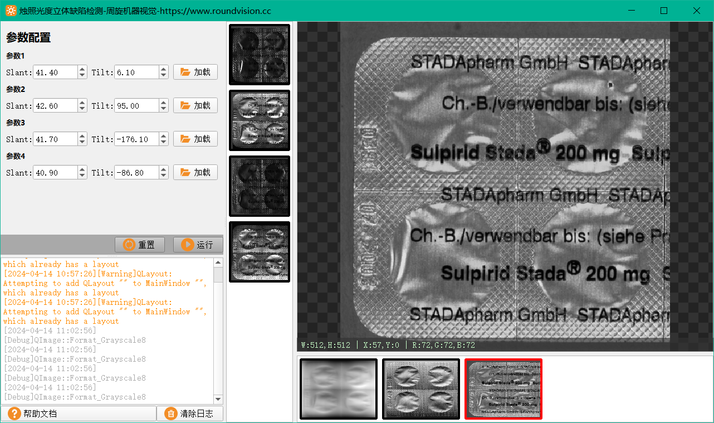
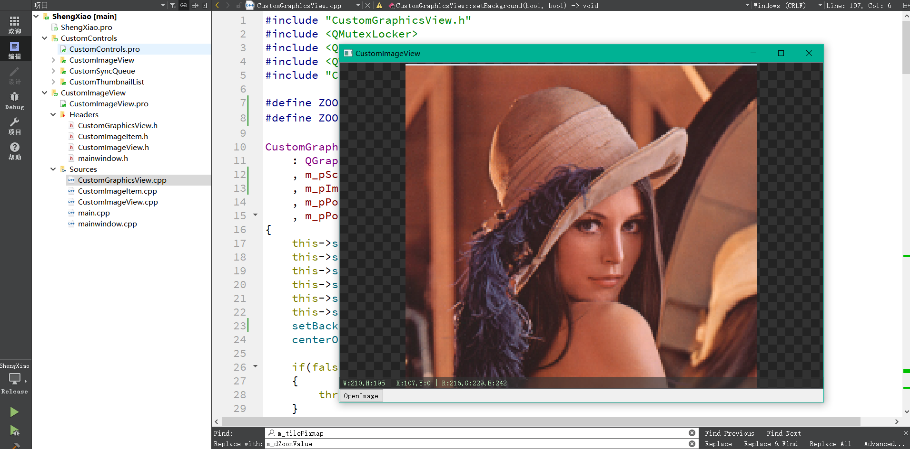
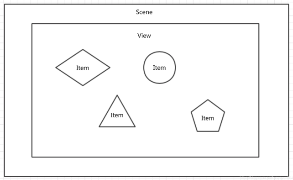
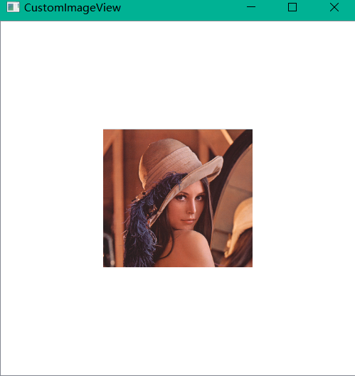
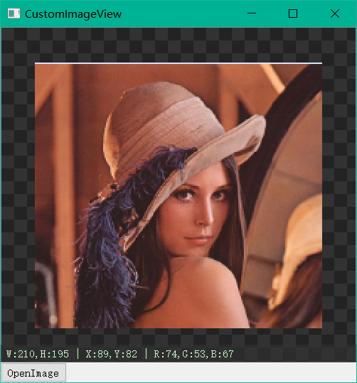

## QT实现机器视觉常用图像查看器

在机器视觉行业中最常见的控件就是图像查看器了，使用QT实现其实也非常简单，在我出的项目【降龙：算法软件框架】和【重明：工业相机二次开发】中都有用到。可以说只要你要开发一个和机器视觉相关的软件，就离不开图像查看器。



如上图烛照项目的软件界面，最右侧的就是图像查看器。本文将图像查看器的代码给大家拆解独立出来，并和大家讲解一下图像查看器的实现原理。

效果展示：



## 1、实现思路

首先介绍一下实现的大体思路，常见图像查看器的实现思路有两种，分别是

1. 使用QWidget和QLabel相结合的方式。这种方式如果你仅仅是想实现图像的显示，那很简单，直接将图像放到QLabel里就可以了，但如果你还想实现图像放大缩小平移查看等功能，就需要自己重写各类鼠标事件，处理复杂的逻辑，所以我们不采用这种方式。
2. 实现思路2就是借助QT的视图模型框架，通过重写自己的QGraphicsView类，就可以轻松实现一个如上文展示效果的图像查看器。

## 2、QT视图模型介绍

在我们常规认知里，例如显示一张图像，那只需要一个QWidget（也可以说是画布），然后我们将图像显示在QWidget上（也可以说画在画布上），就完成了，只需要两个对象，一个图像，一个QWidget窗口。

但在视图模型中，会有三个东西，分别是：

1. Graphics Scene：场景 /场景管理器（ Scene 同时担负着管理场景中的对象，建立索引等工作）。
2. Graphics View：图形视图，也可以说是窗口。
3. Graphics Item：场景中可以被显示的元素，可以是我们的图像，也可以是矩形圆形等任何东西。

在网上的一段对三者的描述非常好：

> **Scene就好比天空，无限大，而Item就是天空中的云朵，可以有很多云，而view就好比一扇窗户，透过窗户可以看到天空中的云，而一片天空可以通过很多扇窗户去看。所以一个Scene可以同时对应多个View，但是一个View只能对应一个Scene。**



## 3、如何使用QGraphics 

QT有现成的视图类，我们直接调用即可，调用也很简单，如下所示：

```c++
    //创建Scene
    QGraphicsScene* pScene = new QGraphicsScene(this);
    //创建View并为其绑定Scene
    QGraphicsView* pView = new QGraphicsView(this);
    pView->setScene(pScene);
    //使用我们的图像初始化一个Item
    QImage srcImage("C:\\Users\\Administrator\\Pictures\\Laner\\Laner.png");
    QGraphicsPixmapItem* pItem = new QGraphicsPixmapItem();
    //设置元素可以选中和拖动
    pItem->setAcceptHoverEvents(true);
    pItem->setFlags(QGraphicsItem::ItemIsSelectable | QGraphicsItem::ItemIsMovable);
    pItem->setPixmap(QPixmap::fromImage(srcImage));
    pScene->addItem(pItem);

    //将我们上面实现的View添加到主界面
    QVBoxLayout* pMainLayout = new QVBoxLayout();
    pMainLayout->setContentsMargins(0,0,0,0);
    pMainLayout->setSpacing(0);
    pMainLayout->addWidget(pView);

    QWidget* pCenterWidget = new QWidget(this);
    pCenterWidget->setLayout(pMainLayout);

    this->setCentralWidget(pCenterWidget);
```

运行效果如下：



效果并不是我们预想的那样，有几个问题：

1. 背景颜色不是我们想要的黑白格或者是任何其它样式，但实际上背景是可以自定义绘制的
2. 图像元素的尺寸没有放大适配我们的窗口界面
3. 双击窗口界面，图像元素不能居中显示
4. 并没有我们左下角半透明的Label，可以显示鼠标的坐标，以及对应图像元素位置的像素值
5. 等等其它问题... ...

所以想实现我们文章开头的预期效果，并不是这么几行就可以搞定的，我们需要重写QGraphicsView类，实现我们预期的自定义功能，例如双击鼠标事件，背景绘制等等。

## 4、重写QGraphicsView类

对于如何重写，我们在文章里就不做详细说明了，代码就是最好的介绍。对于代码关键位置，我也写了详细的注释：

CustomGraphicsView.h：

```c++
#ifndef CUSTOMGRAPHICSVIEW_H
#define CUSTOMGRAPHICSVIEW_H
/**************************************************
 *
 *重写视图类，该类为视觉窗口的核心代码
 *
 **************************************************/

#include <QWidget>
#include <QGraphicsView>
#include <QEvent>
#include <QLabel>

class CustomImageItem;
class CustomGraphicsView : public QGraphicsView
{
    Q_OBJECT
public:
    CustomGraphicsView(QWidget *parent = 0);
    ~CustomGraphicsView();
    //界面初始化
    bool InitWidget();
    //设置视觉窗口的图像
    void SetImage(const QImage & qImage);

protected:
    virtual void wheelEvent(QWheelEvent *event) override;
    virtual void mouseDoubleClickEvent(QMouseEvent *event) override;
    virtual void paintEvent(QPaintEvent* event) override;
    virtual void resizeEvent(QResizeEvent *event) override;

public slots:
    //视图居中显示
    void onCenter();
    //视图缩放
    void onZoom(float fScaleFactor);

private:
    //辅助函数：自适应大小
    void fitFrame();
    void setBackground(bool enabled = true,bool invertColor = false);

private:
    double m_dZoomValue = 1;

    QGraphicsScene* m_pScene;//场景
    CustomImageItem* m_pImageItem;//图像元素
    QWidget* m_pPosInfoWidget;//视觉窗口左下方，用于显示鼠标位置以及对应位置像素灰度值
    QLabel* m_pPosInfoLabel; //显示灰度值的标签

    QPixmap m_Image;//视觉窗口所显示的图像
    QImage m_qImage;
    QPixmap m_tilePixmap = QPixmap(36, 36);//背景图片方格
};

#endif // CUSTOMGRAPHICSVIEW_H

```

CustomGraphicsView.cpp：

```c++
#include "CustomGraphicsView.h"
#include <QMutexLocker>
#include <QLayout>
#include <QWheelEvent>
#include "CustomImageItem.h"

#define ZOOMMAX 50   //最大放大倍数
#define ZOOMMIN 0.02 //最小缩小倍数

CustomGraphicsView::CustomGraphicsView(QWidget *parent)
    : QGraphicsView(parent)
    , m_pScene(Q_NULLPTR)
    , m_pImageItem(Q_NULLPTR)
    , m_pPosInfoWidget(Q_NULLPTR)
    , m_pPosInfoLabel(Q_NULLPTR)
{
    this->setHorizontalScrollBarPolicy(Qt::ScrollBarAlwaysOff);
    this->setVerticalScrollBarPolicy(Qt::ScrollBarAlwaysOff);
    this->setRenderHint(QPainter::Antialiasing);
    this->setTransformationAnchor(QGraphicsView::AnchorViewCenter);
    this->setViewportUpdateMode(QGraphicsView::FullViewportUpdate);
    this->setSceneRect(INT_MIN/2, INT_MIN/2, INT_MAX, INT_MAX);
    setBackground();
    centerOn(0, 0);

    if(false == InitWidget())
    {
        throw std::bad_alloc();
    }
}

CustomGraphicsView::~CustomGraphicsView()
{
}

bool CustomGraphicsView::InitWidget()
{
    //创建变量对象
    m_pScene = new QGraphicsScene(this);
    m_pImageItem = new CustomImageItem(this);
    m_pImageItem->setAcceptHoverEvents(true);
    m_pImageItem->setFlags(QGraphicsItem::ItemIsSelectable | QGraphicsItem::ItemIsMovable);
    this->setScene(m_pScene);
    m_pScene->addItem(m_pImageItem);
    m_pPosInfoLabel = new QLabel(this);
    m_pPosInfoWidget = new QWidget(this);

    //在视觉窗口下方显示鼠标坐标以及图像的灰度值
    m_pPosInfoLabel->setStyleSheet("color:rgb(200,255,200); "
                              "background-color:rgba(50,50,50,160); "
                              "font: Microsoft YaHei;"
                              "font-size: 15px;");
    m_pPosInfoLabel->setText(" W:0,H:0 | X:0,Y:0 | R:0,G:0,B:0");
    //显示区域窗口
    m_pPosInfoWidget->setFixedHeight(25);
    m_pPosInfoWidget->setGeometry(0, this->height() - 25, this->width(), 25);
    m_pPosInfoWidget->setStyleSheet("background-color:rgba(0,0,0,0);");
    QHBoxLayout* pInfoLayout = new QHBoxLayout();
    pInfoLayout->setSpacing(0);
    pInfoLayout->setContentsMargins(0,0,0,0);
    pInfoLayout->addWidget(m_pPosInfoLabel);
    m_pPosInfoWidget->setLayout(pInfoLayout);

    //初始化信号槽
    connect(m_pImageItem, &CustomImageItem::RGBValue, this, [&](QString InfoVal) {
        m_pPosInfoLabel->setText(InfoVal);
        });

    return true;
}

//为视觉窗口设置图像，是一个公共对外接口
void CustomGraphicsView::SetImage(const QImage &image)
{
    static QMutex mutex;
    QMutexLocker locker(&mutex);
    m_qImage = image.copy();
    m_Image = QPixmap::fromImage(image);
    m_pImageItem->w = m_Image.width();
    m_pImageItem->h = m_Image.height();
    m_pImageItem->setPixmap(m_Image);

    fitFrame();
    onCenter();
    show();
}

//重写鼠标滚轮滚动的事件函数
//主要依赖于Zoom()方法
void CustomGraphicsView::wheelEvent(QWheelEvent *event)
{
    //滚轮的滚动量
    QPoint scrollAmount = event->angleDelta();
    if ((scrollAmount.y() > 0) && (m_dZoomValue >= ZOOMMAX)) //最大放大到原始图像的50倍
    {
       return;
    }
    else if ((scrollAmount.y() < 0) && (m_dZoomValue <= ZOOMMIN))//最小缩小到原始图像的50倍
    {
      return;
    }

    // 正值表示滚轮远离使用者,为放大;负值表示朝向使用者,为缩小
    scrollAmount.y() > 0 ? onZoom(1.1) : onZoom(0.9);
}

//在视觉窗口上双击鼠标左键，会有图像居中效果，主要依赖于onCenter()方法。
void CustomGraphicsView::mouseDoubleClickEvent(QMouseEvent *event)
{
    if(event->button() == Qt::LeftButton)
    {
        //自适应图像大小至视觉窗口的大小
        fitFrame();
        //居中显示
        onCenter();
    }
    QGraphicsView::mouseDoubleClickEvent(event);
}

//绘制函数，用于视觉窗口背景绘制
void CustomGraphicsView::paintEvent(QPaintEvent* event)
{
    QPainter paint(this->viewport());
    //绘制背景
    paint.drawTiledPixmap(QRect(QPoint(0, 0), QPoint(this->width(), this->height())), m_tilePixmap);
    QGraphicsView::paintEvent(event);
}

//当窗口尺寸发生变化时，实时更新视觉窗口位置
void CustomGraphicsView::resizeEvent(QResizeEvent *event)
{
    fitFrame();
    onCenter();
    m_pPosInfoWidget->setGeometry(0, this->height() - 25, this->width(), 25);
    QGraphicsView::resizeEvent(event);
}

//视图居中
void CustomGraphicsView::onCenter()
{
    //调用QGraphicsView自带的方法centerOn，使视觉窗口的中心位于图像元素的中心点
    //并设置m_pImageItem的坐标，使其也位于中心点
    this->centerOn(0,0);
    m_pImageItem->setPos(-m_pImageItem->pixmap().width()/2,-m_pImageItem->pixmap().height()/2);
}

void CustomGraphicsView::onZoom(float scaleFactor)
{
    //记录下当前相对于图像原图的缩放比例，可以记录下当前图像真实放大缩小了多少倍
    //可以借此来限制图像的最大或最小缩放比例
    m_dZoomValue *= scaleFactor;
    //调用视图类QGraphicsView自带的scale缩放方法，来对视图进行缩放，实现放大缩小的功能
    //缩放的同时，视图里的所有元素也会进行缩放，也就达到了视觉窗口放大缩小的效果
    this->scale(scaleFactor, scaleFactor);
}

//图片自适应方法，根据图像原始尺寸和当前视觉窗口的大小计算出应缩放的尺寸，再根据已经缩放的比例计算还差的缩放比例，
//补齐应缩放的比例，使得图像和视觉窗口大小相适配
void CustomGraphicsView::fitFrame()
{
    if (this->width() < 1 || m_Image.width() < 1)
        return;

    //计算缩放比例
    double winWidth = this->width();
    double winHeight = this->height();
    double ScaleWidth = (m_Image.width() + 1) / winWidth;
    double ScaleHeight = (m_Image.height() + 1) / winHeight;
    double s_temp = ScaleWidth >= ScaleHeight ? 1 / ScaleWidth : 1 / ScaleHeight;
    double scale = s_temp / m_dZoomValue;
    if ((scale >= ZOOMMAX) || (scale <= ZOOMMIN)) //最大放大到原始图像的50倍
    {
        return;
    }

    onZoom(scale);
    m_dZoomValue = s_temp;
}

//设置视觉窗口背景为棋盘格样式
void CustomGraphicsView::setBackground(bool enabled, bool invertColor)
{
    if (enabled)
    {
        m_tilePixmap.fill(invertColor ? QColor(220, 220, 220) : QColor(35, 35, 35));
        QPainter tilePainter(&m_tilePixmap);
        constexpr QColor color(50, 50, 50, 255);
        constexpr QColor invertedColor(210, 210, 210, 255);
        tilePainter.fillRect(0, 0, 18, 18, invertColor ? invertedColor : color);
        tilePainter.fillRect(18, 18, 18, 18, invertColor ? invertedColor : color);
        tilePainter.end();

        //当取消注释时，视觉窗口背景格会跟随图像一起缩放
        //setBackgroundBrush(m_tilePixmap);
    }
    else
    {
        //setBackgroundBrush(Qt::transparent);
    }
}
```

运行效果截图：



## THE END

