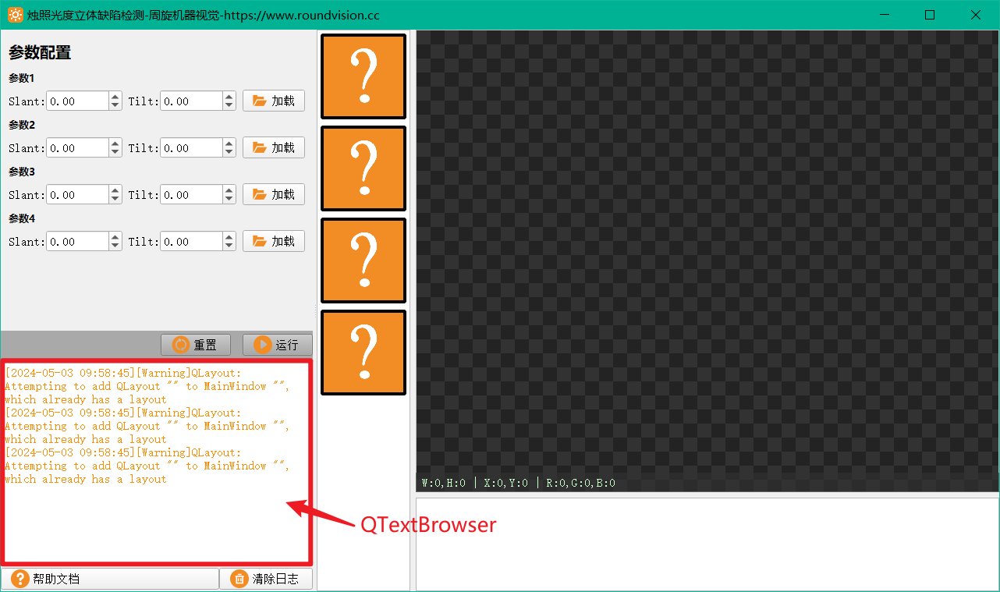
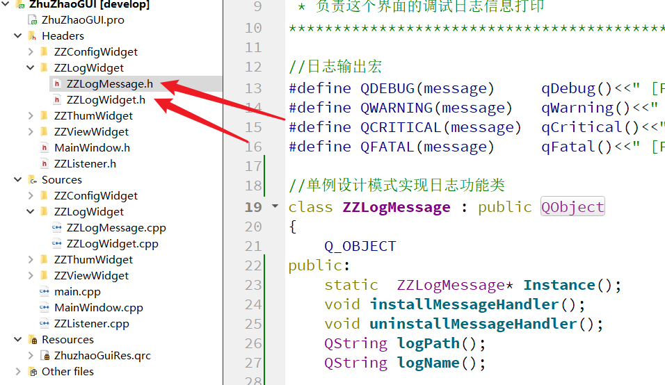

## 如何制作一个日志模块

QT有专门的类来做日志的重定向功能，就是将QDebug输出的内容打印到一个页面控件上，这个控件一般就是我们的日志窗口，是由一个QTextBrowser制作的。



QT为我们提供了日志重定向的接口，我们只需要按照固定的逻辑来实现即可。



我们日志部分代码有两个：

1. ZZLogMessage：该类实现日志的功能实现，如日志重定向打印到控件内，或者打印到本地保存等等。该类使用了单例设计模式。
2. ZZLogWidget：该类为日志窗口界面实现类，主要包含一个显示日志的QTextBrowser和一个清空日志的按钮

### 单例设计模式

在我们龙门教程中，有介绍过多个基础的设计模式。单例设计模式是最最基础的设计模式。大家可以通过我们的源码看一下其具体实现。单例设计模式可以将你的类变为一个全局唯一的全局变量类，使用起来非常方便。

单例设计模式实现起来也特别方便，只需要将构造函数设为私有接口，然后声明一个static静态的类对象即可：

```c++
//单例设计模式实现日志功能类
class ZZLogMessage : public QObject
{
    Q_OBJECT
public:
    static  ZZLogMessage* Instance();
    void installMessageHandler();
    void uninstallMessageHandler();
    QString logPath();
    QString logName();

private:
    explicit ZZLogMessage(QObject *parent = nullptr);
    ~ZZLogMessage();
    static ZZLogMessage* m_pLogInstance;

signals:
    void sigDebugStrData(const QString &);
    void sigDebugHtmlData(const QString &);
};
```

### QT日志功能实现步骤

#### 1、安装消息器

在我们的main函数开头，安装日志消息器

```c++
//安装消息器
ZZLogMessage::Instance()->installMessageHandler();
QDEBUG("启动日志系统");
```

#### 2、实现一个接受调试信息的函数

该函数的接口是固定的，函数的功能就是将日志信息按自己想要的格式进行规范化处理，然后在将日志文本传递出去，可以通过信号的形式进行传递。

#### 3、绑定信号槽

将我们第一步传递日志文本的信号，和我们的打印日志的控件创建信号槽链接：

```c++
//绑定信号，将调试信息输出值ui
connect(ZZLogMessage::Instance(), &ZZLogMessage::sigDebugHtmlData, m_pLogTextBrowser, &QTextBrowser::append);
```


