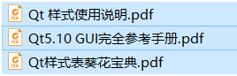
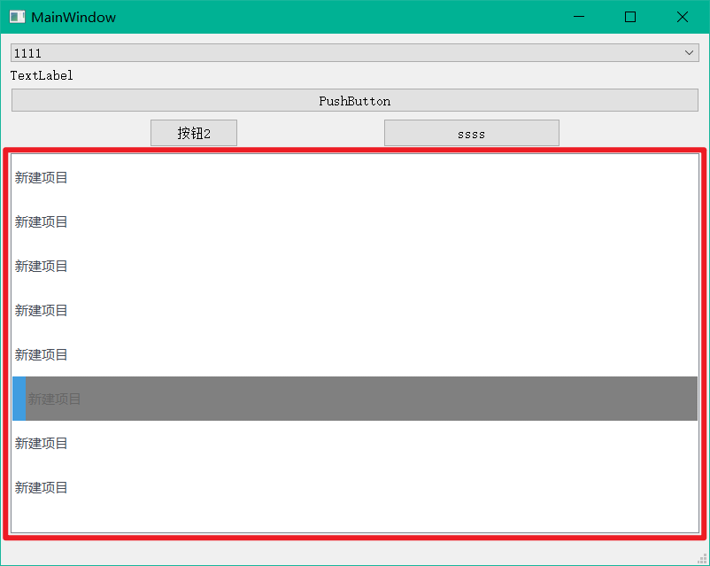
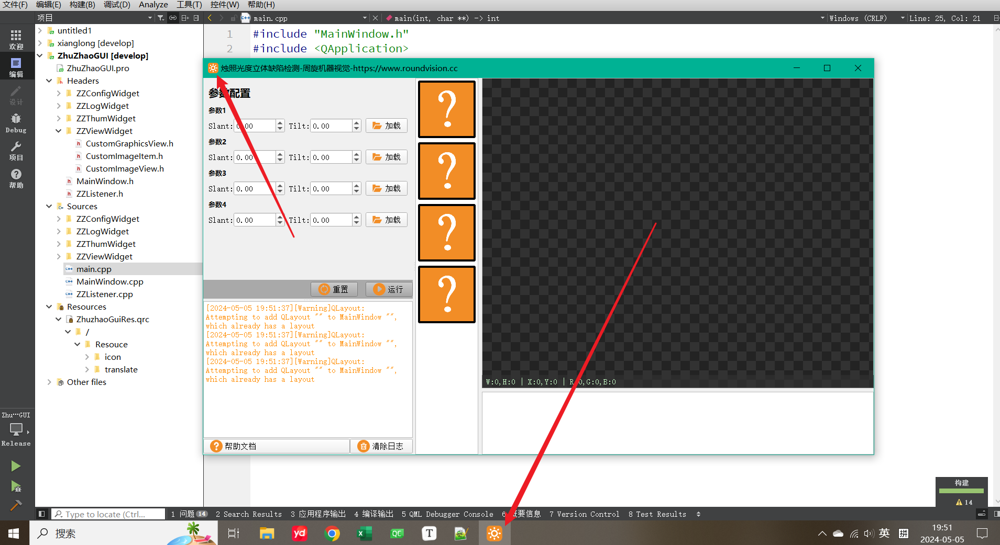
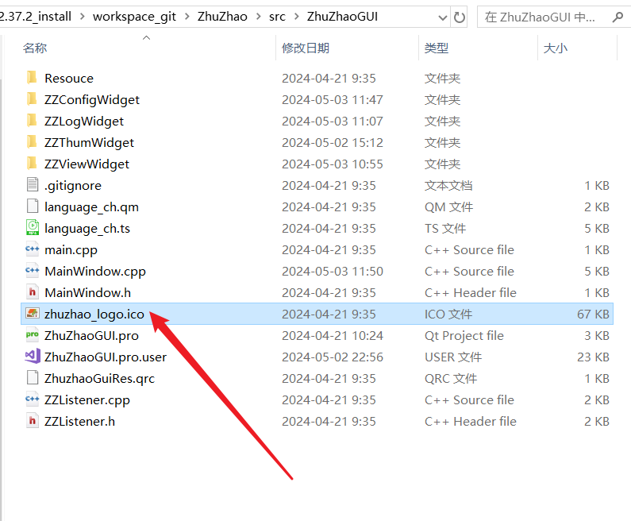
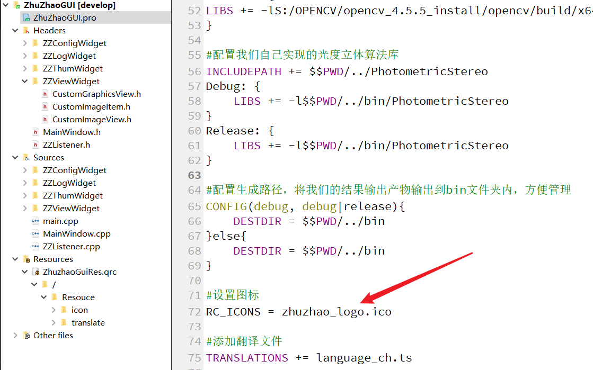

## QT界面美化技巧

使用QT开发出来的原生界面，不能说丑但肯定不够漂亮，所以我们一般都会进行美化。

正常软件开发过程中，在开发之前，会有专门的美工团队先根据需求和规格，对界面进行美化设计，给出最终的样式效果，比如下图，就是一款设计好的界面：


我们开发软件，只需要按照上图的界面进行实现就可以了，不存在“界面设计”这个流程。

我们本文也不讲界面设计。如果仅是实现上图的样式，在QT开发中，就直接使用QSS进行美化即可。

### 1、常规QSS界面美化

QSS是一个QT提供的界面设计语言，和CSS类似。QSS的语法我们不做介绍，在本教程的资源文件夹里给大家放几本QSS的书籍，在网上也都能搜到，有需要自学即可：



给大家看一下样式表可以做什么。例如一个平平无奇的列表控件QListWidget：


为它设置如下样式表QSS：

```css
QListWidget 
{
    color: palette(WindowText);
    background: palette(Window);
    margin:0px,0px,0px,0px;
}

QListWidget::item 
{
    min-height: 50px;   /*设置item高度*/
    border-style: none;  /*去掉item的borber*/
    color: palette(WindowText); /*文字颜色*/
}

QListWidget::Item:selected 
{
    background: palette(Light);
    color: palette(BrightText); /*文字颜色*/
    border-left: 15px solid palette(Highlight);/*左侧边缘*/
}
```

即可达到如下效果：



在我们出的所有项目中，都是使用QSS进行的界面美化。

### 2、美化技巧

除了QSS外，其实我们个人开发一些小工具，是完全不需要使用QSS的，只需要一些小技巧即可让界面变得美观好看。值得尝试。

#### 1、设置风格

```c++
// 设置应用程序样式代码
QStyle *style = QStyleFactory::create("fusion");  // windows,windowsvista,fusion
a.setStyle(style);
```

在main函数开头，使用QStyle为界面设置为fusion风格，要比默认的windows风格好看很多。

#### 2、设置图标

在网上找到图标，如在iconfont网站：

https://www.iconfont.cn/

寻找合适的图标，并将图标添加保存到资源文件，为按钮等控件设置图标，可以美化界面。

#### 3、设置软件icon

为软件添加一个具有标识性的图标，可以提高软件的美感：


我们需要找一个Png格式的图标图像，然后使用图标制作网站：

https://www.bitbug.net/

制作一个ico格式的图标：



将图标放到pro同级目录，然后在pro中添加RC_ICONS关键字即可生效：

