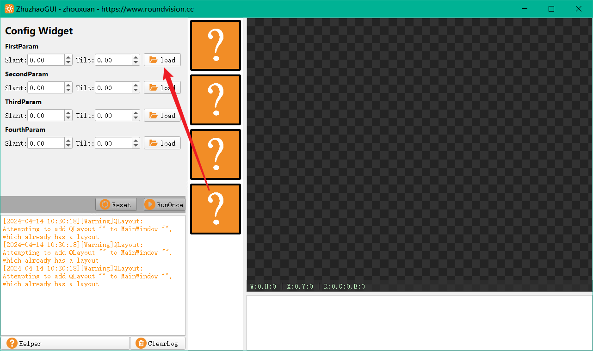
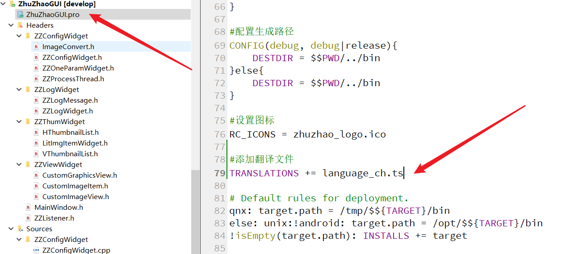
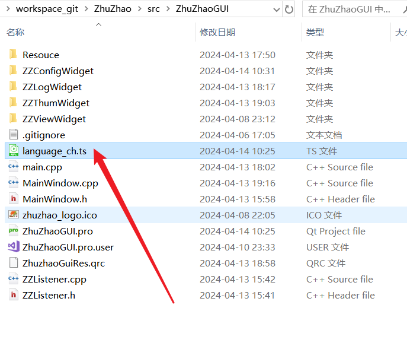
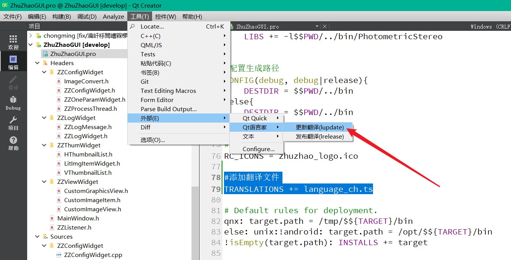
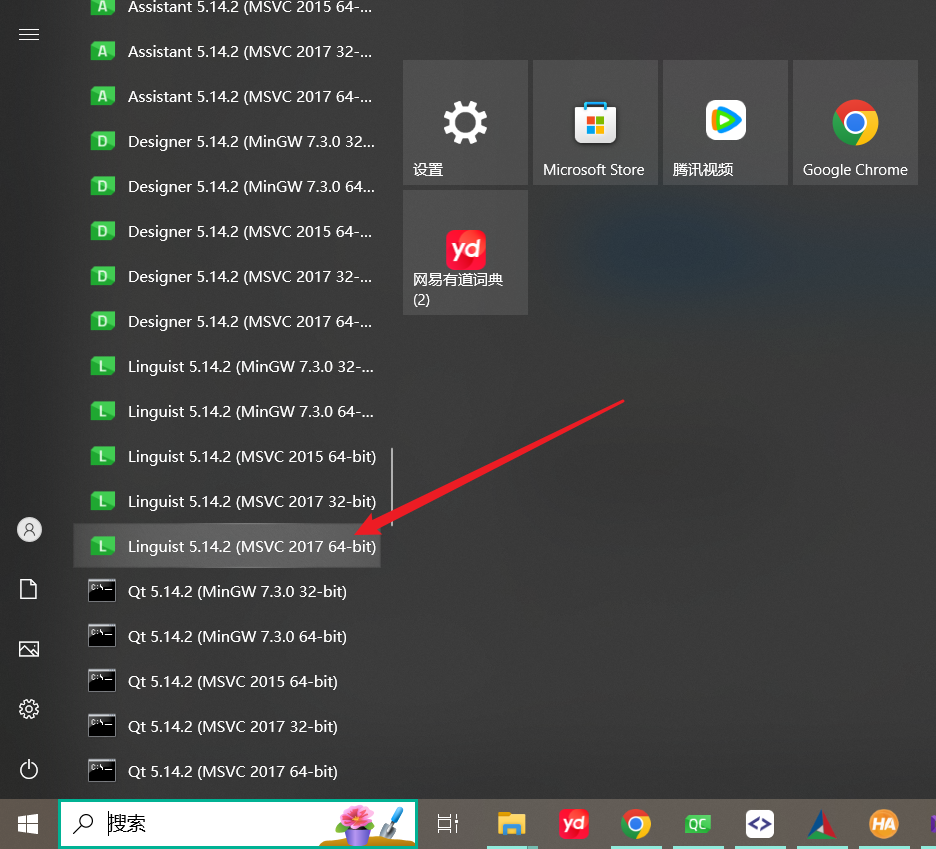
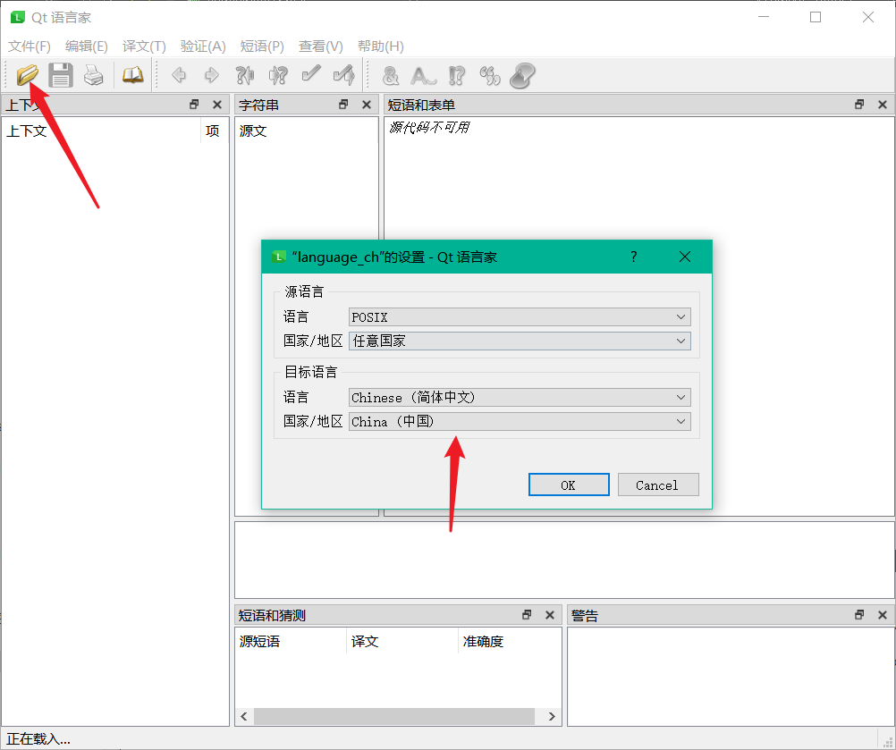
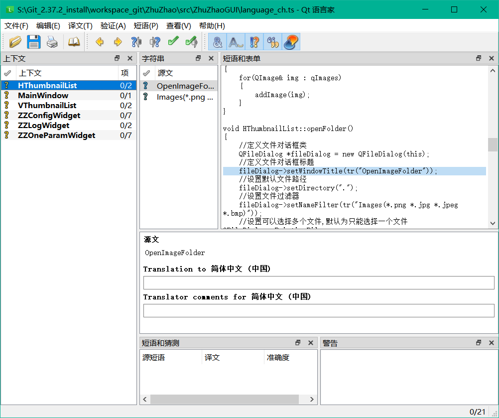
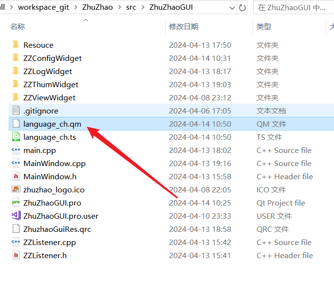
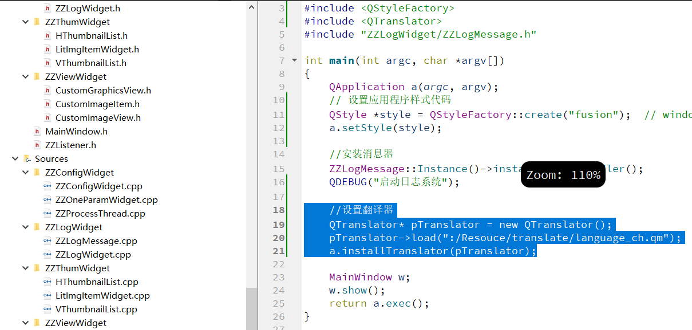
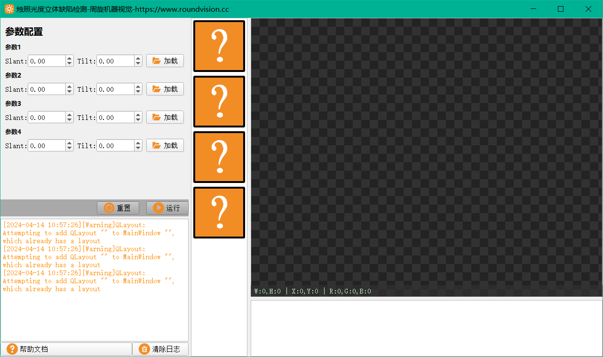

## 如何添加QT翻译文件实现中英文翻译

在QT软件开发中，我们界面上想要中文怎么办？比如我们有一个按钮：

```c++
    m_pLoadImageBtn = new QPushButton(this);
    m_pLoadImageBtn->setText(tr("load"));
    m_pLoadImageBtn->setFixedSize(80, OneParamWidgetHeiht);
    m_pLoadImageBtn->setIconSize(QSize(24,24));
    m_pLoadImageBtn->setIcon(QIcon(":/Resouce/icon/loadimg.png"));
```

我们将按钮文字设为了load，也就是加载，在界面上显示，也是load：


可以看到我们界面上全是英文的，我们想让它变为中文，怎么办？一种方法是直接设置中文：

```c++
    m_pLoadImageBtn = new QPushButton(this);
    m_pLoadImageBtn->setText("加载");
    m_pLoadImageBtn->setFixedSize(80, OneParamWidgetHeiht);
    m_pLoadImageBtn->setIconSize(QSize(24,24));
    m_pLoadImageBtn->setIcon(QIcon(":/Resouce/icon/loadimg.png"));
```

但这种非常非常不推荐，在我们的源码中写中文，一旦换一个编译环境，就很可能导致乱码，所以我们在源码编写过程中，都建议先写英文，然后通过翻译文件的方式，将英文翻译为中文，这是规范的开发方式。

当然，如果你的软件很小整个界面也就那么几个名字，你不想费劲用翻译文件也没关系。不过用翻译文件其实也不怎么费劲。

### 1、QT工程添加翻译文件



在我们的软件pro工程文件中添加一行

```cmake
#添加翻译文件
TRANSLATIONS += language_ch.ts
```

就是添加了一个翻译文件，执行qmake，可以看到源码路径下生成了一个ts翻译文件，language_ch这个名字是可以自定义的：



ts文件是翻译文件，我们需要手动对其进行翻译，打开QT自带的语言家工具：



翻译有两种动作，一种叫更新update，一种叫发布release，每当我们源码中的需要翻译的文字发生改变时，我们就需要更新翻译文件ts，然后去重新翻译ts，翻译好之后重新发布翻译文件，发布的翻译文件是qm文件。

点击更新翻译后，language_ch.ts是被更新了的，然后我们使用QT语言家工具打开ts文件：

打开QT语言家：



然后选择我们的language_ch.ts文件，第一次打开会让选择语言，我们选择简体中文：



接下来我们就可以开始翻译了，具体QT语言家怎么用，大家随便点两下就知道了，很简单。



当我们所有的待翻译语句都翻译完毕，也就是问好全部变为对号时，我们点击保存和发布即可。发布后，会生成同名qm文件，即language_ch.qm文件：



ts是用来翻译的文件，而qm是当软件运行起来时所需要用到的文件，两者一个静态，一个动态。软件不会自动加载language_ch.qm来实现翻译功能，需要我们手动加载，所以有两个方法：

1. 将language_ch.qm放到软件exe的同级目录，然后手动去加载这个文件
2. 将language_ch.qm加入到软件的qrc资源文件中，就和图标一样，然后通过资源文件加载翻译文件qm

我们采用第二种，所以先将language_ch.qm加入到资源文件，然后在程序启动时，也就是main函数内，加载翻译器：



```C++
    //设置翻译器
    QTranslator* pTranslator = new QTranslator();
    pTranslator->load(":/Resouce/translate/language_ch.qm");
    a.installTranslator(pTranslator);
```

现在我们运行软件，可以看到翻译已经生效了，采用ts这种翻译文件的形式进行翻译，不会产生因环境不同导致的乱码问题：



