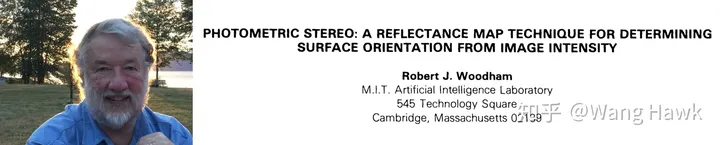
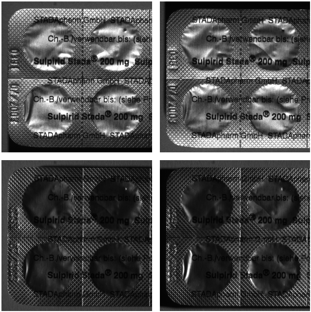
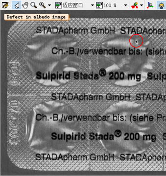
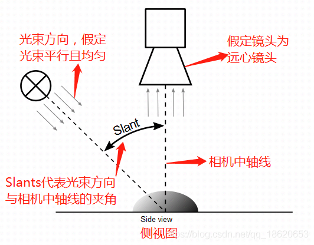
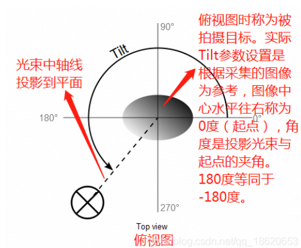
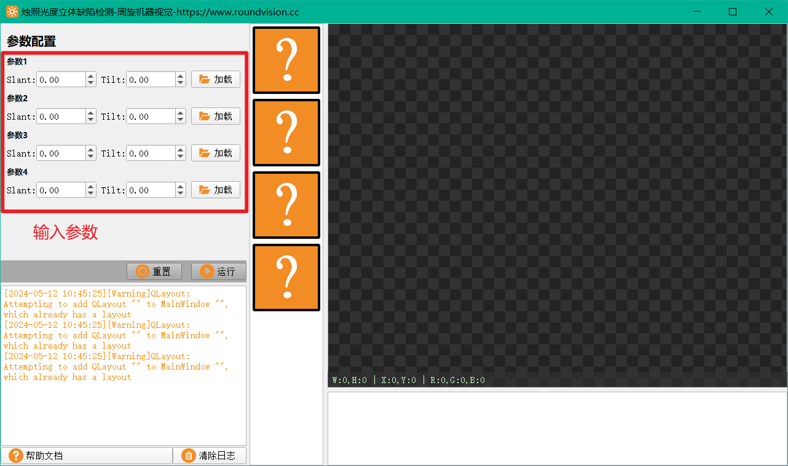

## 光度立体算法概述

光度立体法，即Photometric Stereo, 最早是由当时在MIT的人工智能实验室的Robert J. Woodham教授在1978年左右提出，比较系统的阐述可以看他在1979年的论文《Photometric stereo: A reflectance map technique for determining surface orientation from image intensity》，以及1980年的论文《Photometric Method for Determining Surface Orientation from Multiple Images》。

这个论文的内容和原理，原本是用作三维重建的，但时隔40年，它同样在机器视觉行业得到应用。所以光度立体并不是什么新算法，它只是一个上世纪就已经被提出的算法。

### 1、光度立体的实际应用场景

看上图的医疗药片板的缺陷检测，因为铝箔的炫光原因，导致上图从各种角度进行打光得到不同的四张图像，效果都不理想。但是借鉴光度立体算法的原理，我们将这四张图做处理和计算，得到反照率图像，反照率图像就可以有较好的图像质量：

### 2、光度立体算法的输入参数

注意，这里我们就已经知道我们光度立体算法的输入参数是什么了：**四张以相同光源，在不同角度下拍摄得到的不同的图像。**以及这四个不同的角度值。

角度有两个角度，分别是Slants和Tilts两个参数角度，其共同描述了相对于当前场景的光照角度。

为了更好的理解这两个参数含义，我们假定光源射出的光束是平行光，镜头是远心镜头，相机垂直于物体表面。

**Slant参数：**    

**Tilt参数：**

其实这里的参数数量不一定要是四组，只要大于等于3组就可以了，例如6组，9组，12组等等。因为光度立体算法公式中有三个未知量，我们需要最少3组数据组成超定方程，才可求解。

