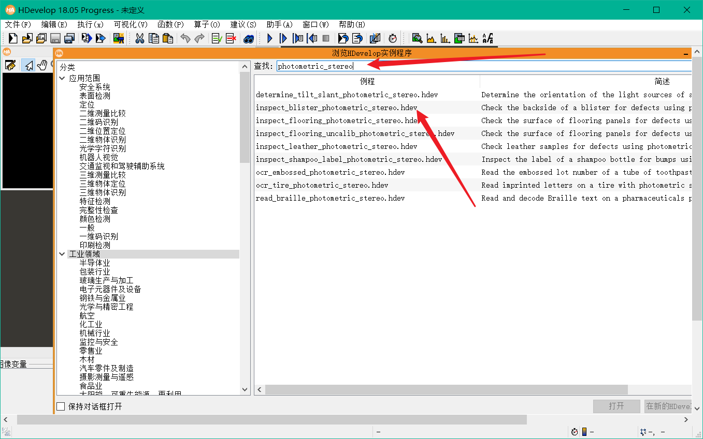
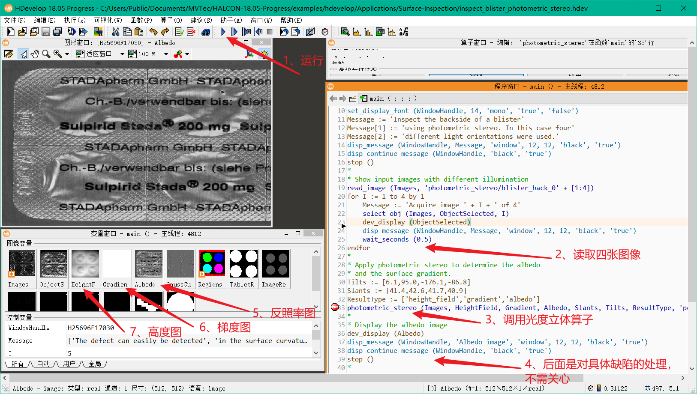
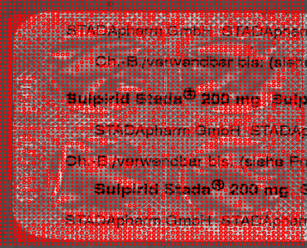
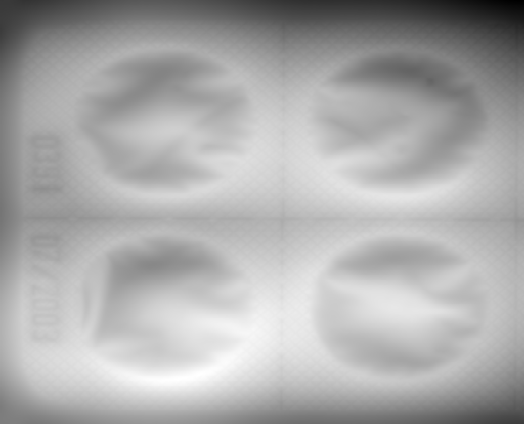

## Halcon中的光度立体算法

如果你是初次接触机器视觉，不了解halcon的话，可以自行百度一下：

HALCON是德国MVTec公司开发的一套完善的标准的机器视觉算法包，拥有应用广泛的机器视觉集成开发环境。它节约了产品成本，缩短了软件开发周期——HALCON灵活的架构便于机器视觉，医学图像和图像分析应用的快速开发。在欧洲以及日本的工业界已经是公认具有最佳效能的Machine Vision软件。


总而言之，halcon是机器视觉行业的标杆产品之一，我们可以先看一下标杆的光度立体算法是如何实现的，打开halcon自带的例程，里面有光度立体算法的例程photometric_stereo：



搜索photometric_stereo光度立体，有若干例程，选择一个打开。



整个例程的代码我们就不逐行分析了，如果你会halcon，那看例程应该很轻松，如果不会，那也没必要逐行分析。我们只给大家介绍一下：

1. 点击三角符号，会单步运行halcon例程，可以查看例程运行效果
2. 代码：先读取四张图像，图像是从本地halcon自带的示例图片文件夹内读取的
3. 代码：调用光度立体算子photometric_stereo，执行算法
4. 代码：光度立体算法执行完会得到若干结果图像，基于结果图像进行具体的缺陷检测和处理，这里我们就不关心了，不同的缺陷有不同的处理方式，我们只讲到光度立体算法本身
5. 光度立体输出图像：反照率图像
6. 光度立体输出图像：梯度图
7. 光度立体输出图像：高度图

**反照率图像：**


**梯度图像：**



**高度图/深度图像：**



### photometric_stereo算子

```c#
* Apply photometric stereo to determine the albedo
* and the surface gradient.
Tilts := [6.1,95.0,-176.1,-86.8]
Slants := [41.4,42.6,41.7,40.9]
ResultType := ['height_field','gradient','albedo']
photometric_stereo (Images, HeightField, Gradient, Albedo, Slants, Tilts, ResultType, 'poisson', [], [])
```

photometric_stereo算子的参数很简单明了：

1. Images：输入，四张不同角度拍摄的图像
2. HeightField：输出，高度图
3. Gradient：输出，梯度图
4. Albedo：输出，反照率图
5. Slants：输入，一个4长度的Slants角度数组
6. Tilts：输入，一个4长度的Tilts角度数组
7. ResultType：输入，设置算子输出结果图像包含哪些，我们设置['height_field','gradient','albedo']，就是包含高度图，梯度图，反照率图三个

