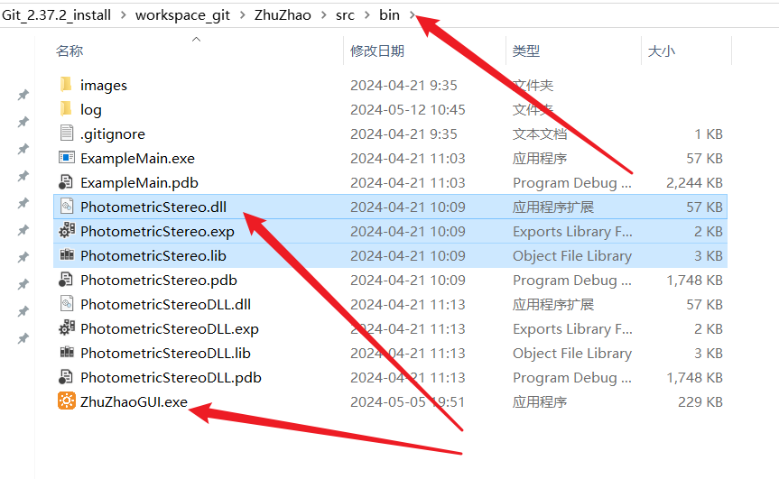
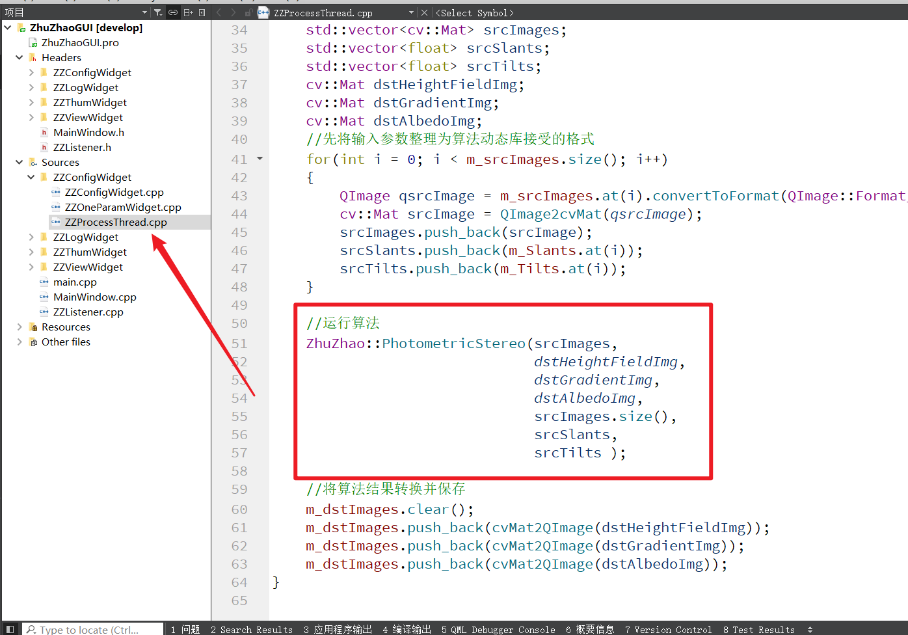

## 如何生成动态库提供给前端调用

这个动态库调用，其实只是配置一下动态库即可。但对于一些纯小白，我还是将一些要点提出来说一下，如果不说，可能存在信息差导致有些内容无法理解。

**如果你对动态库静态库都分不清楚，一定要去看第二章龙门教程中关于动态库的讲解。**

### 1、库类型

首先，我们后端算法生成的产物，是由CMake决定的：

```cmake
# S.2创建光度立体算法动态库
FILE(GLOB 
	DLL_SRCS
	PhotometricStereo.cpp 
	PhotometricStereo.h
	)

add_library(PhotometricStereoDLL SHARED ${DLL_SRCS})
TARGET_LINK_LIBRARIES(PhotometricStereoDLL ${OpenCV_LIBS})
```

我们使用add_library，决定了我们后端生成物为动态库，而不是静态库或者exe可执行文件。

### 2、库的生成位置

我们在CMake中，使用

```cmake
set(CMAKE_RUNTIME_OUTPUT_DIRECTORY ${ZZ_DEBUG_BUILD_DIR})
```

设置了库的生成路径，直接将动态库PhotometricStereo.dll，生成到了和ZhuZhaoGUI.exe同级目录中：



这就实现了我们exe可以在同级目录中找到动态库并直接调用。

### 3、前端对后端算法库依赖的配置

我们在ZhuZhaoGUI的前端工程文件，也就是ZhuZhaoGUI.pro文件中，配置了对烛照算法库的依赖：

```cmake
#配置我们自己实现的光度立体算法库
INCLUDEPATH += $$PWD/../PhotometricStereo
Debug: {
    LIBS += -l$$PWD/../bin/PhotometricStereo
}
Release: {
    LIBS += -l$$PWD/../bin/PhotometricStereo
}
```

通过相对路径配置，保证了不需要做任何额外操作，就可以直接依赖算法动态库。

### 4、前端代码调用库的位置

在前端代码ZZProcessThread.cpp内，通过包含库的头文件，完成对库的调用。

