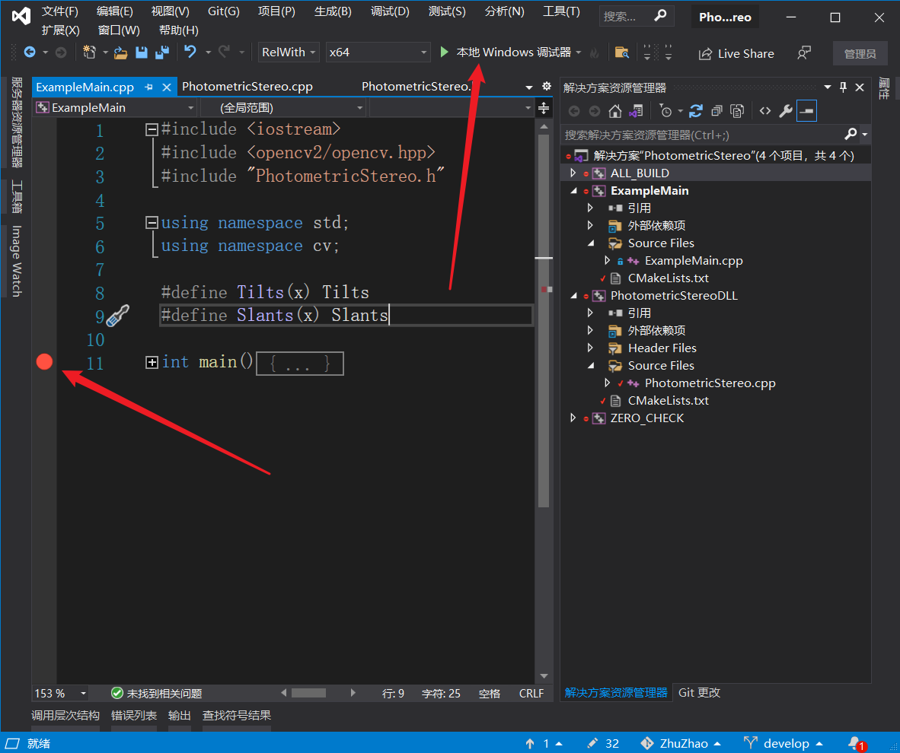
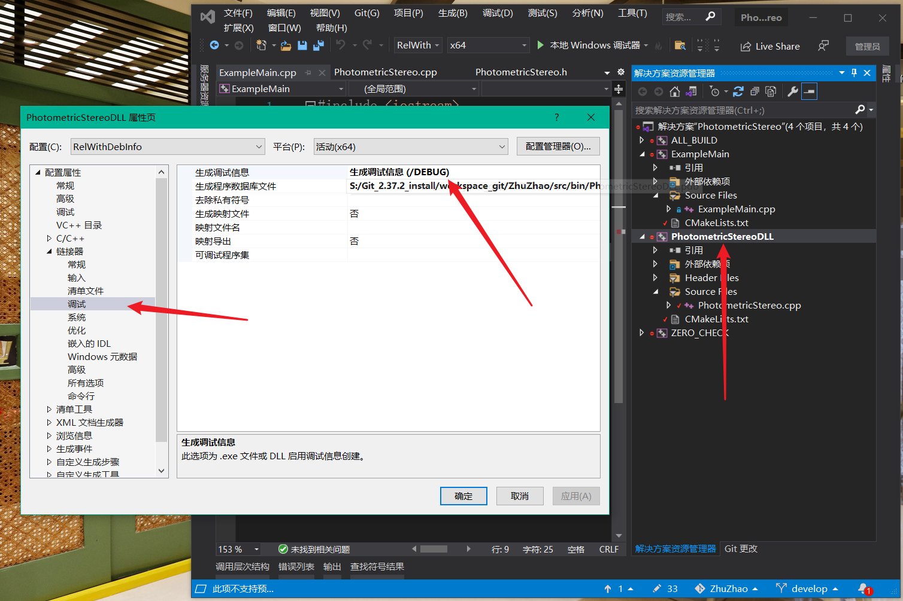
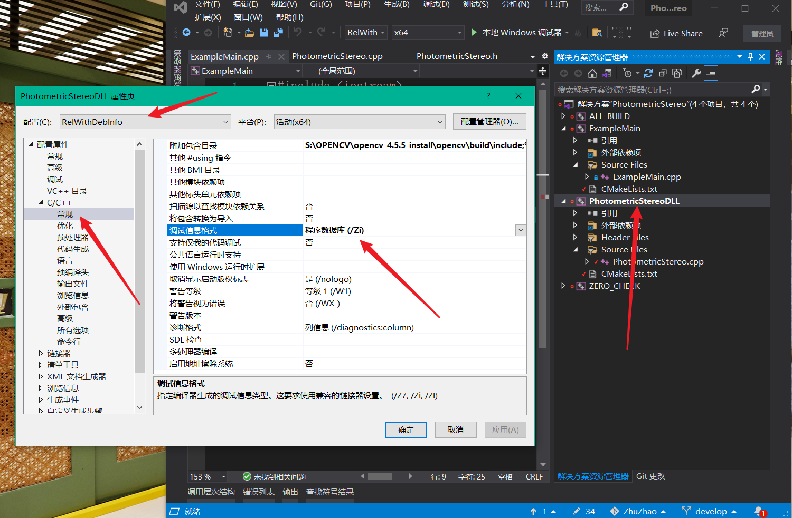
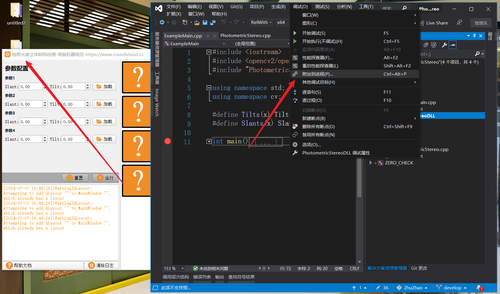

## VS动态库调试技巧

我们的烛照课程接近尾声了，感谢大家的支持。

最后一节，我们继续为大家讲解一些干货，VS动态库调试技巧，这是将贯穿你未来整个职业生涯的基本技能。

调试大家其实都知道，在C++项目中，直接VS点一下本地Windows调试器，然后打个断点，就可以调试了。

### 1、配置管理器

必须要生成调试pdb文件，才可以成功断点调试。而能否生成调试pdb文件，是由配置管理器控制的，如果我们手动创建VS工程，则配置管理器只有release和debug两个版本，但CMake生成的VS工程，会为我们配置

- release
- debug
- RelWithDebInfo
- MinRelSize

四个配置版本，其中我们最常用的就是RelWithDebInfo，它既兼顾了release的优化，也生成了调试信息，利于我们调试。

### 2、如何生成pdb文件

RelWithDebInfo和release和区别，就在于RelWithDebInfo基于release的基础上，又设置了生成pdb调试信息文件。

如果让我们手动设置，应该如何呢？

1、设置项目的链接器-》调试-》生成调试信息，修改为“生成调试信息 (/DEBUG)”。

2、设置项目的C/C++-》常规-》调试信息格式为“程序数据库 (/Zi)”。

这样设置下来，就可以生成pdb调试文件了。

### 3、如何附加到进程调试

下面是重点了，我们在同一个VS项目里，是可以随意调试的，不需要关心过多。但现在，我们的光度立体算法库，是提供给QT前端程序zhuzhaoGUI.exe调用的，而我们zhuzhaoGUI.exe，是QT Creater写的前端界面程序，和我们的动态库程序根本不在一个项目里。

或者，甚至我们前端程序如果是C#写的，然后调用的我们C++的动态库，连语言都不是同一个了。

这可该怎么调试呢？这时就需要用到附加到进程调试了。

附加到进程调试有一个前提条件，例如我们动态库是PhotometricStereoDLL.dll，我们的前端exe是ZhuZhaoGUI.exe，那我们必须保证，PhotometricStereoDLL.pdb是和它俩在同一个位置，这样才可以调试。

然后我们运行ZhuZhaoGUI.exe，这时ZhuZhaoGUI.exe其实就是一个单独的软件进程，它会调用PhotometricStereoDLL.dll动态库，这时我们就可以附加到进程调试了。

